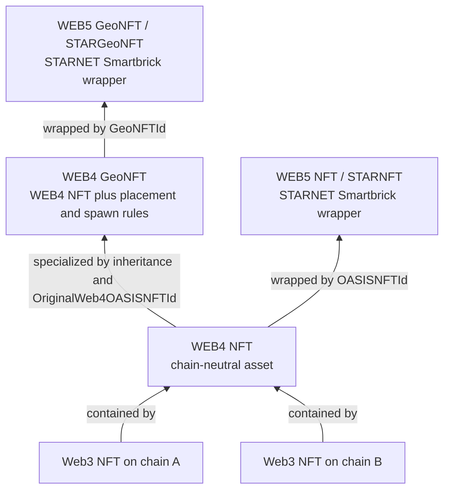
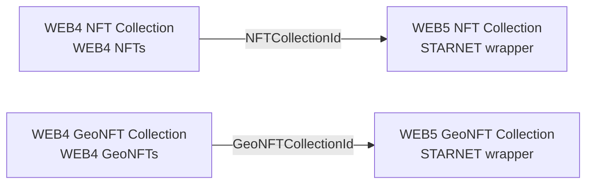
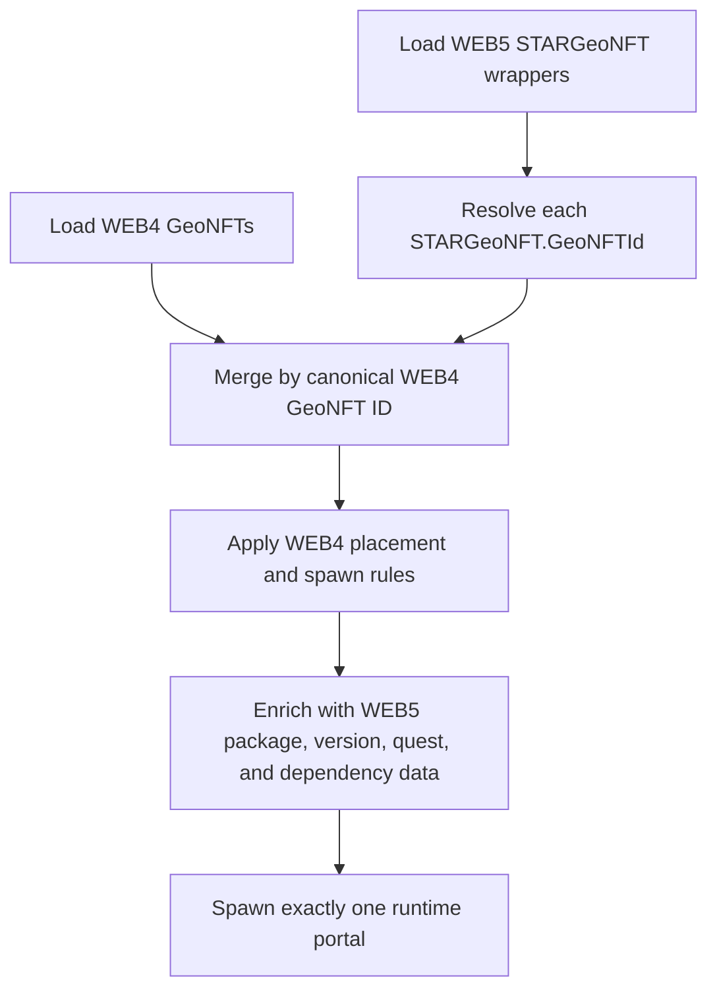

# NFT and GeoNFT architecture across Web3, WEB4, and WEB5

**Status:** Authoritative architecture and client integration decision
**Last updated:** 2026-09-19

This document explains why OASIS has Web3, WEB4, and WEB5 NFT and GeoNFT types, how the wrappers and collections relate, and how clients such as Our World must load them.

## The short version

- A **Web3 NFT** is a token on one blockchain/provider.
- A **WEB4 NFT** is the chain-neutral OASIS asset. It can contain one or more Web3 NFTs, for example representations of the same logical asset on different chains.
- A **WEB4 GeoNFT** is a geographically placed WEB4 NFT. In code it inherits the WEB4 NFT model and adds location, placement, media, visibility, collection-limit, and respawn rules.
- A **WEB5 NFT** (`STARNFT`) wraps a WEB4 NFT for STARNET packaging, discovery, publishing, versioning, installation, sharing, and Smartbrick composition.
- A **WEB5 GeoNFT** (`STARGeoNFT`) wraps a WEB4 GeoNFT for those same STARNET capabilities.
- WEB4 and WEB5 collections follow the same pattern for ordinary NFTs and GeoNFTs.

WEB5 enriches and packages the WEB4 asset. It does not replace the wrapped WEB4 identity or the Web3 tokens below it.

## Layer responsibilities

| Layer/type | Canonical responsibility | Key implementation evidence |
|---|---|---|
| Web3 NFT | Provider/chain token identity, minting, burning, and transaction data | `IWeb3NFT`; each WEB4 NFT may contain multiple `Web3NFTs` |
| WEB4 NFT | Provider-independent logical NFT and bridge across Web3 representations | `IWeb4NFT.Web3NFTs`, `Web4NFT.ParentWeb5NFTIds` |
| WEB4 GeoNFT | Playable geographic placement and collection policy | `Web4OASISGeoSpatialNFT : Web4NFT`; `OriginalWeb4OASISNFTId`, coordinates, media, spawn limits, cooldown, visibility |
| WEB5 NFT | STARNET package/Smartbrick for a WEB4 NFT | `STARNFT.OASISNFTId`; `HolonType.Web5NFT` |
| WEB5 GeoNFT | STARNET package/Smartbrick for a WEB4 GeoNFT | `STARGeoNFT.GeoNFTId`; `HolonType.Web5GeoNFT` |

The wrapper relationship is bidirectional:

- A WEB5 NFT stores the wrapped WEB4 ID in `OASISNFTId`.
- A WEB5 GeoNFT stores the wrapped WEB4 GeoNFT ID in `GeoNFTId`.
- The WEB5 holon also records the WEB4 ID in `ChildrenIds`.
- The wrapped WEB4 object records its WEB5 parent IDs in `ParentWeb5NFTIds`.
- STAR DNA embeds a serialized copy under `WEB4 NFT` or `WEB4 GeoNFT` for packaging. The ID link remains the canonical relationship; an embedded copy must not become a second asset identity.

## Collections

Collections are parallel typed families, not interchangeable containers.

| Collection | Members/backing data | WEB5 wrapper |
|---|---|---|
| WEB4 NFT Collection | `Web4NFTs` / `Web4NFTIds` | `STARNFTCollection`, linked by `NFTCollectionId` |
| WEB4 GeoNFT Collection | `Web4GeoNFTs` / `Web4GeoNFTIds` | `STARGeoNFTCollection`, linked by `GeoNFTCollectionId` |
| WEB5 NFT Collection | STARNET representation of the wrapped WEB4 NFT collection, publishable and composable as a Smartbrick | `HolonType.Web5NFTCollection` |
| WEB5 GeoNFT Collection | STARNET representation of the wrapped WEB4 GeoNFT collection, publishable and composable as a Smartbrick | `HolonType.Web5GeoNFTCollection` |

The WEB4 collections keep `ParentWeb5NFTCollectionIds` or `ParentWeb5GeoNFTCollectionIds`, while the WEB5 collection stores the wrapped WEB4 collection ID and includes it in its child relationship. A WEB5 collection therefore exposes its WEB5/STARNET package and the typed WEB4 members behind that package; it does not convert GeoNFT members into ordinary NFTs or create duplicate playable placements.

## Why WEB5 wrappers exist

The WEB4 object owns the portable NFT or geographic gameplay data. Wrapping it as a WEB5 STARNET holon adds:

- listing and discovery in the STARNET App/Asset Store;
- package publishing, download, installation, sharing, and version control;
- STARNET DNA, categories, versions, dependencies, and package files;
- Smartbrick composition with OAPPs, GeoHotSpots, quests, celestial bodies, holons, libraries, runtimes, plugins, templates, collections, and other supported STARNET dependency types.

This is composition metadata around a real WEB4 asset. Gameplay systems must resolve the wrapper to its WEB4 asset before applying placement, collection, or spawn rules.

## Our World decision: support both WEB4 and WEB5 GeoNFTs

Our World must support both public paths:

1. **Standalone WEB4 GeoNFTs** for creators and API clients that need the direct, streamlined geographic NFT workflow without publishing a STARNET package.
2. **WEB5 GeoNFTs** for assets published, versioned, discovered, installed, or composed through STARNET.

The client must not load those feeds as unrelated portal lists. The canonical runtime identity is the wrapped **WEB4 GeoNFT ID**.

### Required load and merge algorithm

1. Load eligible standalone WEB4 GeoNFT records from the WEB4 GeoNFT API.
2. Load eligible WEB5 `STARGeoNFT` records from the WEB5/STARNET API.
3. Resolve every WEB5 record through its non-empty `GeoNFTId` to the corresponding WEB4 GeoNFT. Treat a missing or unresolvable `GeoNFTId` as a real data error; do not silently manufacture a placement from incomplete wrapper metadata.
4. Index all resolved records by WEB4 GeoNFT ID.
5. If only a WEB4 record exists, create one runtime GeoNFT from it.
6. If a WEB4 record and one or more WEB5 wrappers exist, create one runtime GeoNFT, use WEB4 as the authority for placement/collection/spawn data, and attach the applicable WEB5 package metadata and relationships.
7. If multiple WEB5 versions or packages wrap the same WEB4 GeoNFT, select the explicitly installed/quest-referenced version according to STARNET version rules. Never spawn one portal per wrapper.
8. Collection calls use the WEB4 GeoNFT ID because collection and spawn eligibility belong to the geographic asset. Quest/STARNET progress may additionally carry the WEB5 wrapper ID where the authored quest references that Smartbrick.

Our World resolves an individual wrapped asset with `GET /api/nft/load-geo-nft-by-id/{web4GeoNftId}`. This typed route uses `NFTManager.LoadWeb4GeoNftAsync`; the generic `load-nft-by-id` route must not be used because it decodes the ordinary WEB4 NFT contract rather than the GeoNFT placement contract.

### Source and authority matrix

| Runtime concern | Authority |
|---|---|
| Portal identity and deduplication | WEB4 GeoNFT `Id` |
| Coordinates and placement | WEB4 GeoNFT |
| Collection limits, ownership, cooldown, and respawn | WEB4 GeoNFT/shared geospatial policy enforced by the authoritative API |
| NFT/Web3 token data | WEB4 NFT and its `Web3NFTs` |
| Store listing, package version, install state, and dependencies | WEB5 `STARGeoNFT` / STARNET DNA |
| Quest reference | The authored quest reference; resolve WEB5 references to the underlying WEB4 GeoNFT for runtime placement |
| Inventory item after collection | One collected logical item linked to the WEB4 GeoNFT; retain WEB5 provenance when applicable |

## GeoNFT versus GeoHotSpot

GeoNFT and GeoHotSpot remain distinct public types and APIs:

- GeoNFT is the streamlined NFT-focused placement and collection workflow.
- GeoHotSpot is the general trigger/content/action workflow for power users and bespoke experiences.
- A GeoHotSpot may grant a GeoNFT as a reward.
- Both use the shared geospatial placement/spawn-policy engine, but neither public API replaces the other.
- WEB4 and WEB5 GeoNFT support in Our World is independent of whether GeoHotSpots are also enabled.

See [GeoHotSpot Quest Integration](GEOHOTSPOT_QUEST_INTEGRATION_IMPLEMENTATION.md) for trigger and reward behavior.

## Lifecycle examples

### Direct WEB4 GeoNFT

1. Mint or select a WEB4 NFT.
2. Create/place a WEB4 GeoNFT with location and spawn rules.
3. Our World loads it directly and uses its WEB4 ID for runtime identity and collection.

### Published WEB5 GeoNFT

1. Create the WEB4 NFT and WEB4 GeoNFT as above.
2. Create a `STARGeoNFT` wrapper whose `GeoNFTId` references the WEB4 GeoNFT.
3. Publish/version/share/install it through STARNET or compose it into another Smartbrick.
4. Our World resolves the wrapper to the WEB4 record, enriches it with WEB5 context, and still spawns one portal for the underlying WEB4 GeoNFT.

### Collection

1. Create the correct typed WEB4 collection.
2. Add WEB4 NFT members or WEB4 GeoNFT members to that collection.
3. Optionally create the matching WEB5 collection wrapper for STARNET publishing and composition.
4. A client resolves the WEB5 collection to the WEB4 collection and its typed members; it does not treat the wrapper and backing collection as two collections of playable assets.

## Invariants and validation

- A WEB5 GeoNFT must have a valid `GeoNFTId`.
- A WEB5 NFT must have a valid `OASISNFTId`.
- WEB5 wrapper creation must persist both directions of the relationship.
- NFT collections accept NFT members; GeoNFT collections accept GeoNFT members.
- A WEB5 collection wrapper must point to the matching WEB4 collection type.
- Our World must deduplicate by WEB4 GeoNFT ID across WEB4 and WEB5 responses.
- Spawn and collection rules come from the resolved WEB4 GeoNFT, never from a stale embedded DNA snapshot.
- Errors resolving a wrapper are visible and actionable; clients must not use a silent fallback that can create inconsistent gameplay.

## Code map

- WEB4 NFT model: `OASIS Architecture/NextGenSoftware.OASIS.API.Core/Objects/NFT/Web4NFT.cs`
- WEB4 GeoNFT model: `OASIS Architecture/NextGenSoftware.OASIS.API.Core/Objects/NFT/GeoSpatialNFT/Web4OASISGeoSpatialNFT.cs`
- WEB4 NFT collection: `OASIS Architecture/NextGenSoftware.OASIS.API.Core/Holons/Web4NFTCollection.cs`
- WEB4 GeoNFT collection: `OASIS Architecture/NextGenSoftware.OASIS.API.Core/Holons/Web4GeoNFTCollection.cs`
- WEB5 NFT and GeoNFT wrappers: `ONODE/NextGenSoftware.OASIS.API.ONODE.Core/Holons/STARNET/NFT System/`
- STAR CLI GeoNFT wrapper flow: `STAR ODK/NextGenSoftware.OASIS.STAR.CLI.Lib/GeoNFTs.Create.cs`
- STAR CLI collection wrapper flows: `STAR ODK/NextGenSoftware.OASIS.STAR.CLI.Lib/NFTCollections.cs` and `GeoNFTCollections.cs`
