# OASIS Architecture Diagrams

## High-Level OASIS Ecosystem Architecture

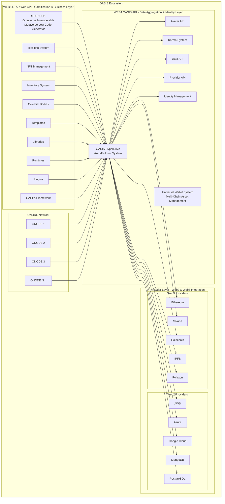

## OASIS HyperDrive Auto-Failover System

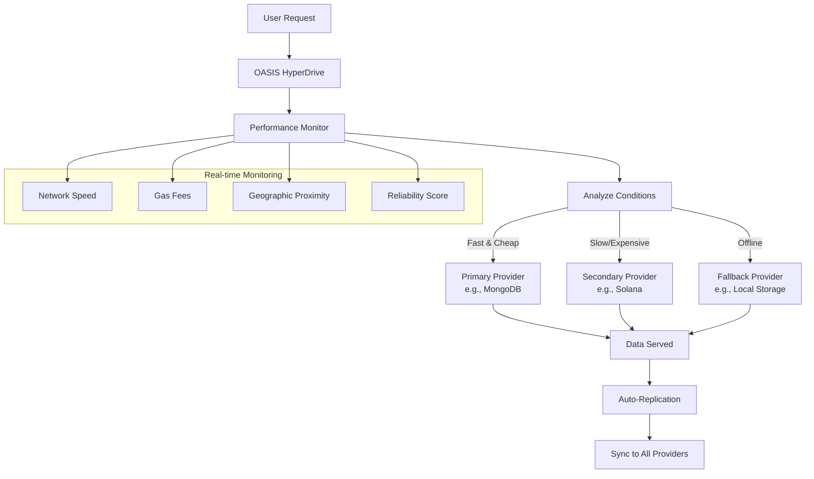

## OASIS Torus Architecture

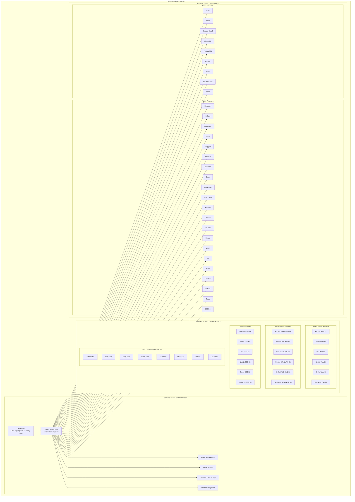

## OASIS Data Flow Architecture

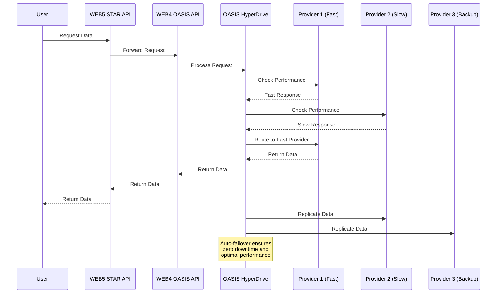

## OASIS Provider Ecosystem

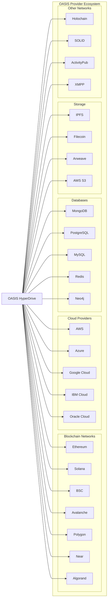

## OASIS Karma System Architecture

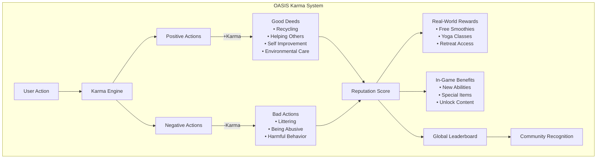

## OASIS Avatar & Identity System

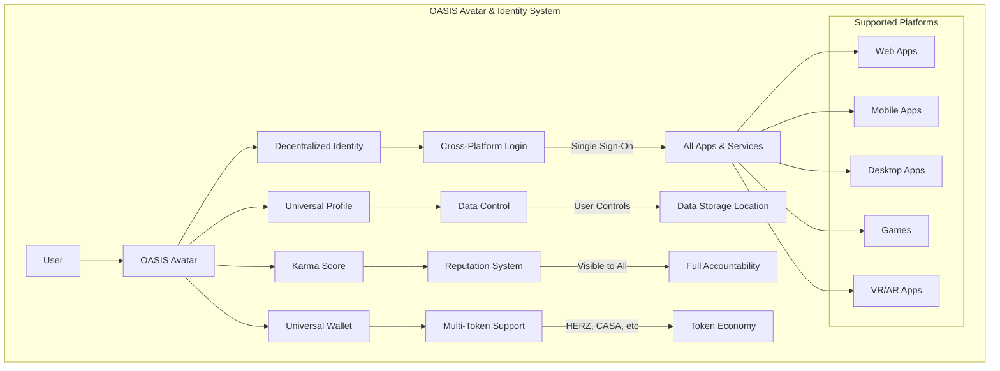

## OASIS OAPPs (OASIS Applications) Framework

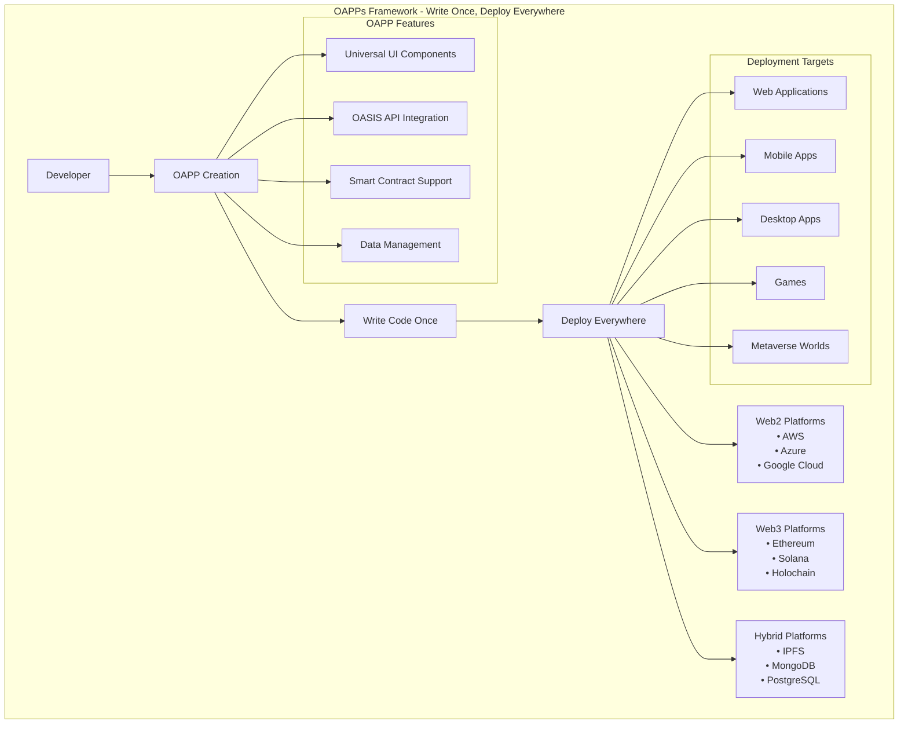

## OASIS Security & Privacy Architecture

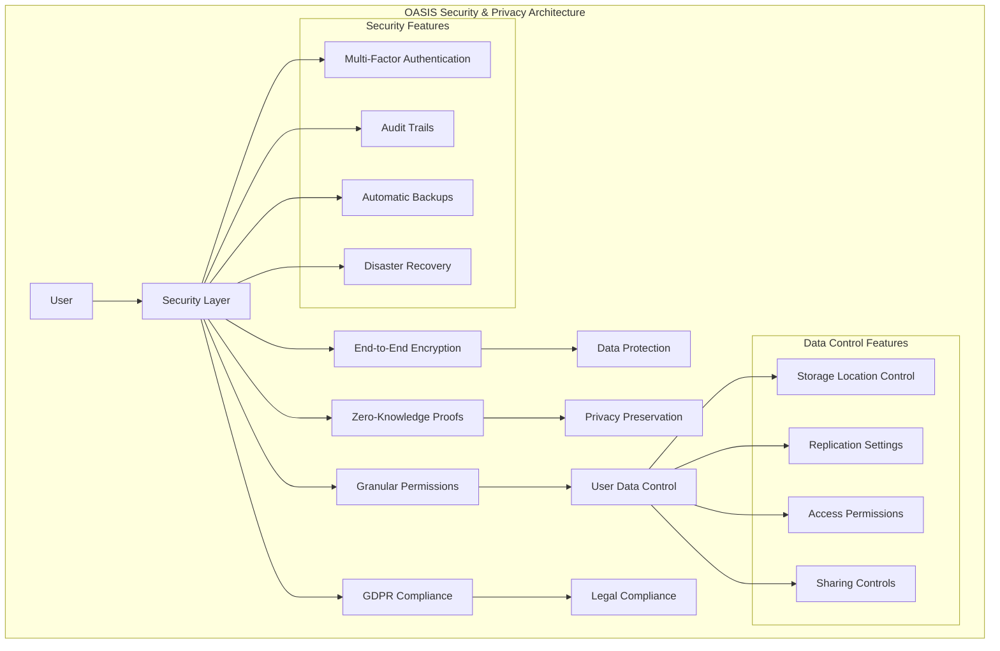

## OASIS Network (ONET) Architecture

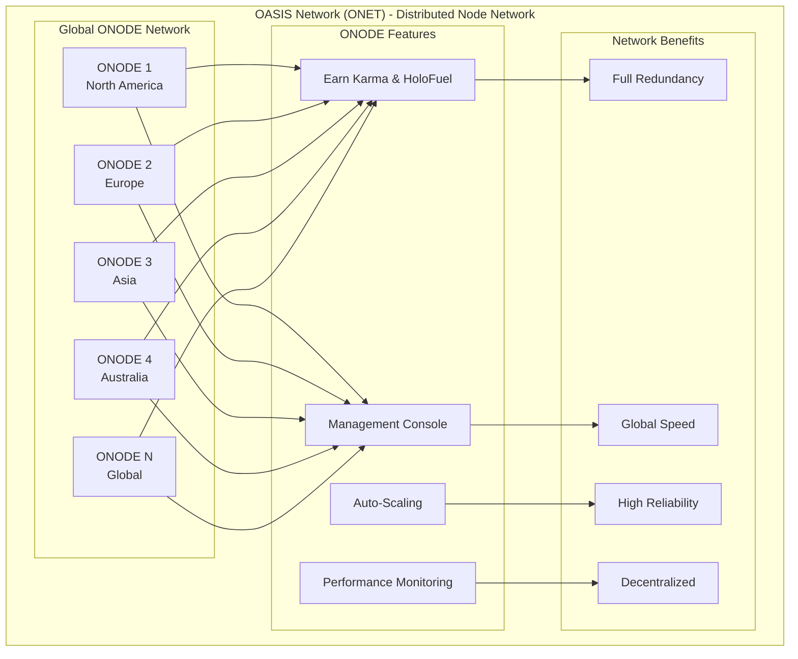

## OASIS AI/ML Integration Architecture

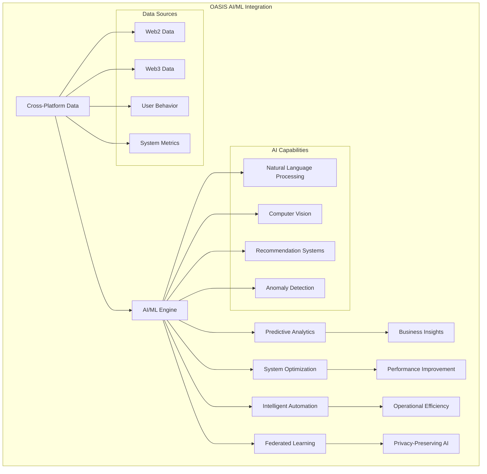

## OASIS Token Economy

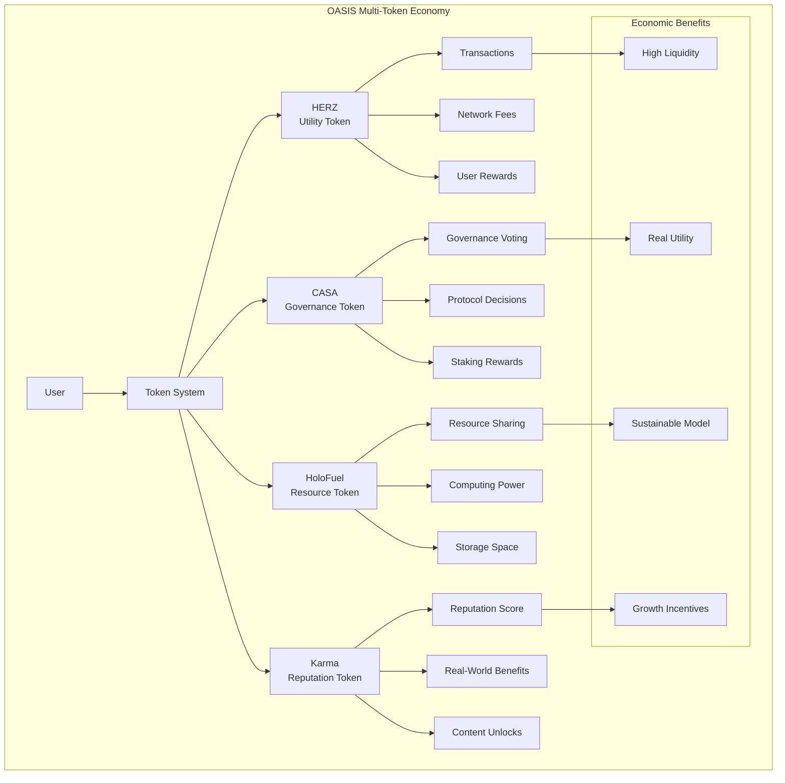

## OASIS HyperDrive Architecture

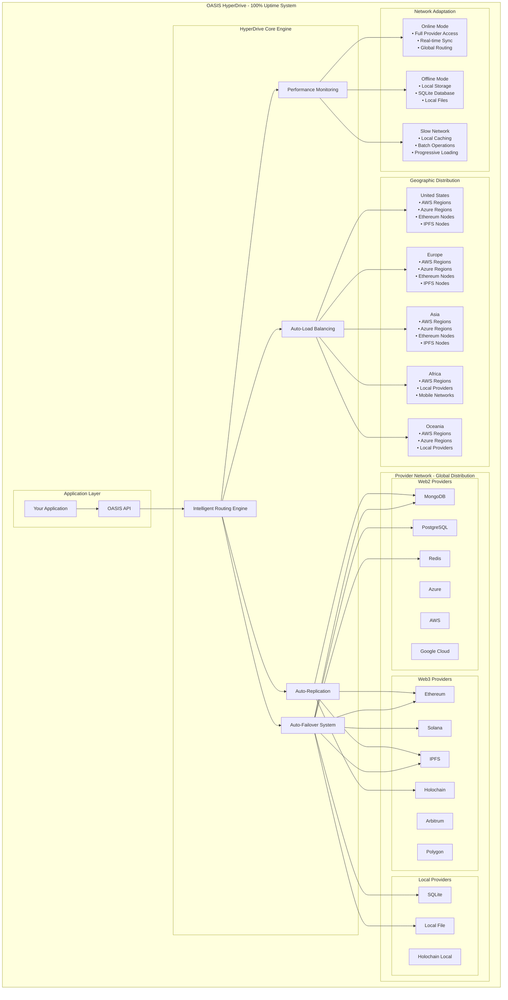

## OASIS COSMIC ORM Architecture

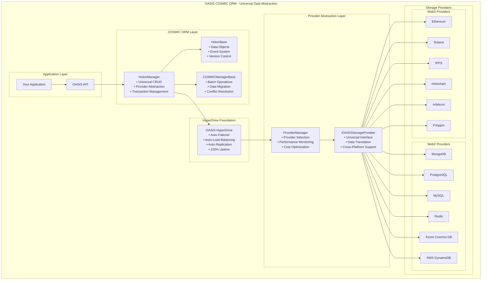

## OASIS NFT System Architecture

```mermaid
graph TB
    subgraph "OASIS NFT System Architecture"
        subgraph "WEB5 STAR NFT Layer"
            STAR_NFT[WEB5 STAR NFT]
            STAR_GEONFT[WEB5 STAR Geo-NFT]
            STARNET_FEATURES[STARNET Features<br/>• Version Control<br/>• Change Tracking<br/>• Publishing<br/>• Search & Discovery<br/>• Download & Install]
        end
        
        subgraph "WEB4 OASIS NFT Layer"
            OASIS_NFT[WEB4 OASIS NFT]
            OASIS_GEONFT[WEB4 OASIS Geo-NFT]
            CROSS_CHAIN[Cross-Chain Support<br/>• Multiple WEB3 NFTs<br/>• Shared Metadata<br/>• Simultaneous Minting]
        end
        
        subgraph "WEB3 NFT Layer"
            ETH_NFT[Ethereum NFT]
            SOL_NFT[Solana NFT]
            POLYGON_NFT[Polygon NFT]
            ARBITRUM_NFT[Arbitrum NFT]
            OPTIMISM_NFT[Optimism NFT]
            BASE_NFT[Base NFT]
            AVALANCHE_NFT[Avalanche NFT]
            BNB_NFT[BNB Chain NFT]
            FANTOM_NFT[Fantom NFT]
            CARDANO_NFT[Cardano NFT]
            POLKADOT_NFT[Polkadot NFT]
            BITCOIN_NFT[Bitcoin NFT]
            NEAR_NFT[NEAR NFT]
            SUI_NFT[Sui NFT]
            APTOS_NFT[Aptos NFT]
            COSMOS_NFT[Cosmos NFT]
            EOSIO_NFT[EOSIO NFT]
            TELOS_NFT[Telos NFT]
            SEEDS_NFT[SEEDS NFT]
        end
        
        subgraph "Geospatial Integration"
            OUR_WORLD[Our World<br/>Geolocation Game]
            GEO_APPS[Other Geo Apps<br/>• Pokemon GO<br/>• Ingress<br/>• Geocaching Apps]
            AR_APPS[AR/VR Apps<br/>• Unity Apps<br/>• Unreal Apps<br/>• WebXR Apps]
        end
        
        subgraph "OASIS NFT Features"
            UNIFIED_STANDARD[Unified NFT Standard<br/>• Universal Format<br/>• Cross-Chain Compatibility<br/>• One-Click Conversion]
            AUTO_REPLICATION[Auto-Replication<br/>• Multi-Chain Deployment<br/>• Metadata Synchronization<br/>• Conflict Resolution]
            INTELLIGENT_ROUTING[Intelligent Routing<br/>• Cost Optimization<br/>• Speed Optimization<br/>• Geographic Optimization]
        end
    end
    
    %% WEB5 to WEB4 connections
    STAR_NFT --> OASIS_NFT
    STAR_GEONFT --> OASIS_GEONFT
    STARNET_FEATURES --> STAR_NFT
    STARNET_FEATURES --> STAR_GEONFT
    
    %% WEB4 to WEB3 connections
    OASIS_NFT --> ETH_NFT
    OASIS_NFT --> SOL_NFT
    OASIS_NFT --> POLYGON_NFT
    OASIS_NFT --> ARBITRUM_NFT
    OASIS_NFT --> OPTIMISM_NFT
    OASIS_NFT --> BASE_NFT
    OASIS_NFT --> AVALANCHE_NFT
    OASIS_NFT --> BNB_NFT
    OASIS_NFT --> FANTOM_NFT
    OASIS_NFT --> CARDANO_NFT
    OASIS_NFT --> POLKADOT_NFT
    OASIS_NFT --> BITCOIN_NFT
    OASIS_NFT --> NEAR_NFT
    OASIS_NFT --> SUI_NFT
    OASIS_NFT --> APTOS_NFT
    OASIS_NFT --> COSMOS_NFT
    OASIS_NFT --> EOSIO_NFT
    OASIS_NFT --> TELOS_NFT
    OASIS_NFT --> SEEDS_NFT
    
    %% Geo-NFT connections
    OASIS_GEONFT --> OUR_WORLD
    OASIS_GEONFT --> GEO_APPS
    OASIS_GEONFT --> AR_APPS
    
    %% Feature connections
    UNIFIED_STANDARD --> OASIS_NFT
    AUTO_REPLICATION --> OASIS_NFT
    INTELLIGENT_ROUTING --> OASIS_NFT
    
    %% Cross-chain connections
    ETH_NFT -.-> SOL_NFT
    SOL_NFT -.-> POLYGON_NFT
    POLYGON_NFT -.-> ARBITRUM_NFT
    ARBITRUM_NFT -.-> OPTIMISM_NFT
    OPTIMISM_NFT -.-> BASE_NFT
    BASE_NFT -.-> AVALANCHE_NFT
    AVALANCHE_NFT -.-> BNB_NFT
    BNB_NFT -.-> FANTOM_NFT
    FANTOM_NFT -.-> CARDANO_NFT
    CARDANO_NFT -.-> POLKADOT_NFT
    POLKADOT_NFT -.-> BITCOIN_NFT
    BITCOIN_NFT -.-> NEAR_NFT
    NEAR_NFT -.-> SUI_NFT
    SUI_NFT -.-> APTOS_NFT
    APTOS_NFT -.-> COSMOS_NFT
    COSMOS_NFT -.-> EOSIO_NFT
    EOSIO_NFT -.-> TELOS_NFT
    TELOS_NFT -.-> SEEDS_NFT
```

## OASIS Universal Wallet System Architecture

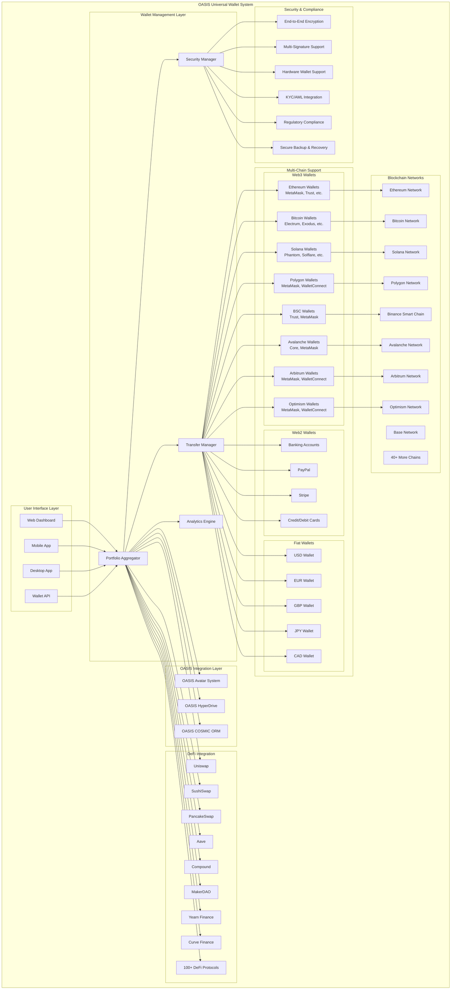

---

*These diagrams represent the current OASIS architecture and can be updated as the system evolves. For the most up-to-date information, please refer to the main documentation.*
