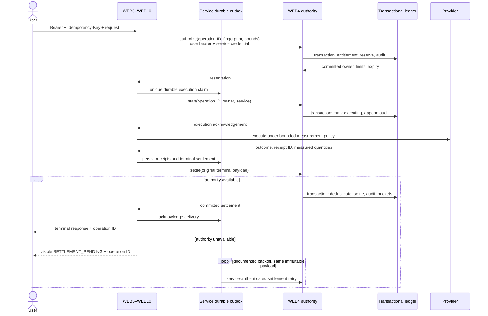

# WEB4 subscription usage protocol

WEB4 owns subscription status, entitlements, quotas, budgets, reservations, settled usage, immutable accounting history and billing-facing totals for WEB5–WEB10. Consuming services own provider execution and measurement. API Core supplies one shared client, durable execution/outbox store and delivery worker. There is no compatibility-counter fallback.

Code lives in ONODE WebAPI `Services/Subscription`, `Services/SubscriptionReconciliation`, and API Core `Services/Subscriptions`. Read the [operations runbook](WEB4_SUBSCRIPTION_USAGE_OPERATIONS.md) before enabling traffic.

## Sequence and durable boundaries

The start handshake is part of reserve → execute → settle. It establishes whether an expired reservation could have incurred costs. No provider execution may precede both the durable execution claim and WEB4 start acknowledgement.

## Identity

Authorize requires a validated user bearer token plus `X-OASIS-Service` and `X-OASIS-Service-Key`. Each consuming service has a distinct secret configured only on WEB4 and that service. WEB4 derives the billing avatar from authentication. Request body/query/AvatarId headers and JWT plan/karma hints cannot choose billing identity or quotas.

Start/settle authenticate the owning service and compare the payload owner with the reservation. They work after the original user token expires; outboxes do not store bearer tokens. Unbound global API keys cannot authorize billable work.

Administration requires an authenticated `oasis.subscription.admin=true` claim **and** membership in `SUBSCRIPTION_ADMIN_AVATAR_IDS`. Subscriber and service credentials cannot administer accounting.

## Idempotency and concurrency

Clients retain an Idempotency-Key across retries. The SDK derives a deterministic UUID from service, authenticated avatar and key, and fingerprints method/route/query/content-type/request bytes. Changed requests cannot reuse a key. WEB4 compares immutable authorization fields and every settlement outcome/provider/quantity/cost/catalogue field, independent of receipt order.

WEB4 commits operation state, UTC month/day buckets and audit deltas in one snapshot transaction with journaled majority acknowledgement. MongoDB must be a replica set or sharded cluster. Concurrent operations serialize on shared subscriber buckets. Unique operation and provider-receipt indexes prevent duplicate accounting; driver-labelled transaction conflicts and bounded duplicate-key creation retries are explicit protocol behavior.

A unique service-outbox claim prevents duplicate provider execution across replicas. Repeated completed requests return operation status/conflict rather than rerunning effects. Arbitrary business response bodies are not replayed by this billing protocol; callers inspect operation and resource status. A new key requests new work.

## Measurement and calendar policy

Operations retain owner, service, endpoint/category, fingerprint, timestamps, reserved units/cost, status/outcome, individual receipts, tokens, units, actual cost and catalogue version. USD uses Decimal128. Round at the invoice boundary, not per call.

`api.request` measures an included request. `ai.tokens` reserves conservative token/USD upper bounds enforced by the consumer's input/output/fan-out policy. Unknown prices and unsupported measurement paths fail before provider work. Failures/cancellation still settle any measured costs. HTTP failure does not mean the provider charged nothing.

Buckets are `{avatar}:month:yyyy-MM` and `{avatar}:day:yyyy-MM-dd`. Late settlement updates the original authorization periods, never resets today's counters. Reserved tokens/costs count against admission until definitive settlement or provably unstarted expiry.

| Plan | Monthly requests | Daily calls before karma | Daily tokens | Monthly budget USD |
|---|---:|---:|---:|---:|
| Free | 1,000 | 20 | 50,000 | 1 |
| Bronze | 10,000 | 100 | 250,000 | 10 |
| Silver | 100,000 | 500 | 1,000,000 | 50 |
| Gold | 1,000,000 | 2,000 | 5,000,000 | 250 |
| Enterprise | Unlimited | Unlimited | Unlimited | Unlimited |

Karma daily-call multipliers: 1 below 500; 1.5 at 500; 2 at 1,000; 3 at 5,000; 5 at 20,000; 10 at 100,000. WEB4 resolves authoritative karma. Zero means unlimited daily calls/tokens/budget; monthly requests use -1. Pay-as-you-go does not authorize an unspecified unbounded budget override.

## States and recovery

| State | Meaning | Next step |
|---|---|---|
| authorized | Reserved, execution not acknowledged | start or unused expiry |
| executing | Durable execution claim acknowledged | settle or recovery-required |
| expired | Expired before start, exposure released atomically | terminal; never execute |
| recovery-required | Execution may have incurred costs; exposure held | provider reconciliation, then late settle |
| settled | Terminal outcome and receipts committed | identical replay; corrections append new audit |

Provider-success/WEB4-outage leaves a durable settlement and visible pending response. Workers retry the same payload with exponential delay and jitter. Transport/429/timeouts remain pending; permanent conflicts/credential failures require repair. Recovery never reruns providers.

A crash between provider execution and persistence of its terminal receipt requires a provider read-only resolver or independent evidence. Missing evidence never means zero usage. Providers without idempotent request identity or receipt lookup cannot support automatic recovery of this boundary; their adapters must reject unsupported work or require explicit evidence-based reconciliation.

The current HTTP response middleware buffers SSE output until settlement acknowledgement; incremental HTTP streaming is a remaining delivery limitation. WebSocket messages require individual keys/reservations and acknowledge terminal success after settlement. Disconnect cannot cancel persistence of observed charges. Cache hits/internal work use explicit measurements. Fan-out preserves individual receipts and sums them once.

## Audit and reconciliation

`subscription_usage_events` is a mutable operation projection. `subscription_usage_audit` is append-only history. `subscription_usage_buckets` contains rebuildable totals. `subscription_usage_receipts` deduplicates provider receipts. Do not confuse operation projections with immutable history.

WEB4 stores authoritative subscriptions and paid invoices in `subscription_records` and `subscription_orders`, with immutable `subscription_billing_audit` history. A verified Stripe event fetches current canonical Stripe state; the subscription change, invoice insertion and unique event receipt commit together. Checkout completion does not fabricate a paid order. Historical Holon subscriptions and invoice evidence must enter through the signed opening manifest before cutover; runtime reads do not fall back to Holon or synthesize a free subscription.

Independent evidence lives in `subscription_usage_external_receipts`; reports append to `subscription_usage_reconciliation`. Snapshot reconciliation compares audit sums with both buckets, individual provider evidence, orphan receipts, unresolved exposure and finalized Stripe usage invoices. It never silently repairs balances. Corrections append signed deltas with authenticated actor, reason and evidence reference; original evidence remains intact.

Stripe reconciliation accepts finalized USD **usage-only** invoices tagged with avatar, usage month and `oasis_usage_cost_basis=ledger-cost-usd-v1`. It compares invoice subtotal with the ledger rounded once to cents. Plan fees, taxes, credits, discounts and other retail pricing models must not use this cost-basis tag. The reader does not issue charges or create invoices. See the operations guide for prerequisites and limitations.

Unique IDs, owner/time, status/expiry, service/recovery and period indexes support operations. No TTL deletes unsettled state, immutable history or deduplication IDs. Archive verified closed periods under the operator's approved retention policy, preserving uniqueness tombstones beyond the retry horizon. Application DB privileges must deny update/delete on immutable history and external evidence.

## Reference and verification

See the [Subscription API](API%20Documentation/WEB4%20OASIS%20API/Subscription-API.md), [Postman collection](API%20Documentation/WEB4%20OASIS%20API/WEB4-Subscription-Usage.postman_collection.json), and [operations/test matrix](WEB4_SUBSCRIPTION_USAGE_OPERATIONS.md). Source guards supplement runtime tests; they do not prove deployed provider billing correctness.

Primary references: [MongoDB C# transactions](https://www.mongodb.com/docs/drivers/csharp/v2.x/fundamentals/transactions/) and [Stripe meter-event identifiers](https://docs.stripe.com/api/billing/meter-event/create). Provider and billing-system acknowledgement are distinct from independent invoice reconciliation.
