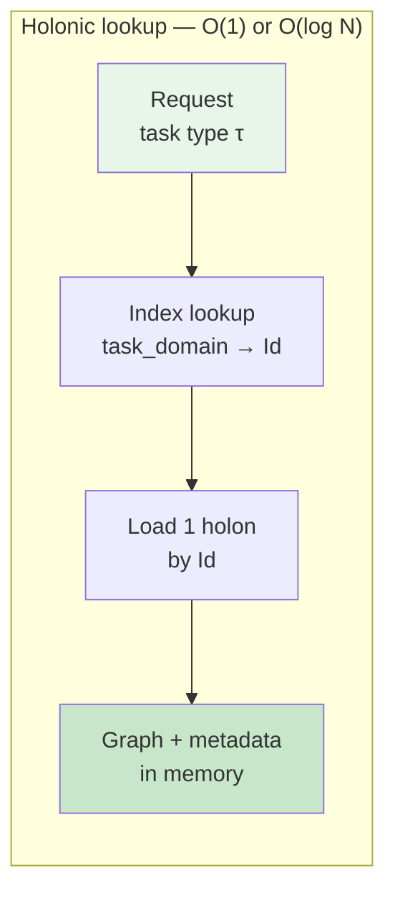
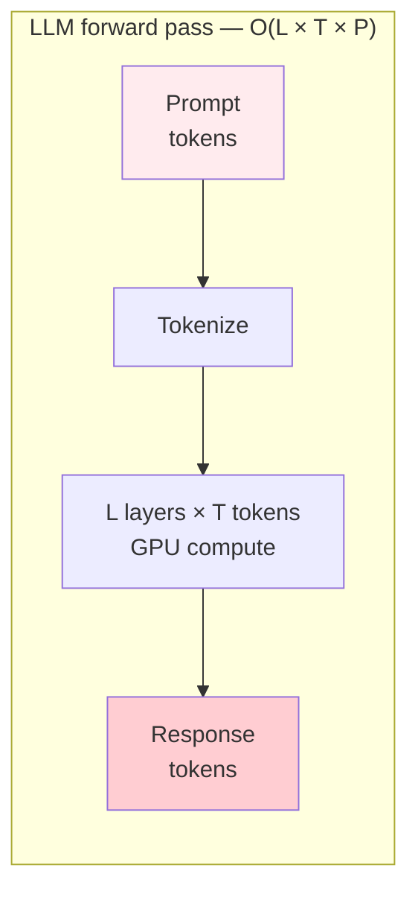
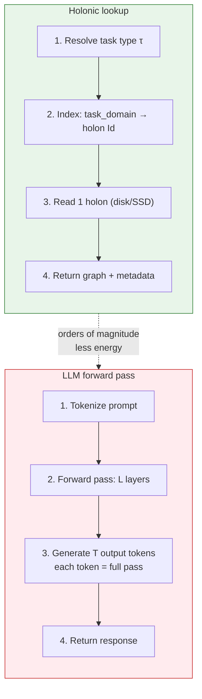

# Holonic Data Centre, Holonic AI, and What “Real” Proof Requires

**Purpose:** This document defines holonic architecture at scale and what it takes to prove it works. **Contents:** (1) **Holonic data centres** — storage and compute as identity-first holons, one copy per unique datum, multi-provider; (2) **Holonic AI** — shared reasoning graphs (BRAID), shared memory, cost ∝ task types + tasks; (3) **Real proof** — the bar (scale, independent processes, measured reuse/cost/correctness) and a phased path to publishable benchmarks; (4) **LLMs** — how holonic works with OpenAI/Anthropic (we reduce calls, not replace models), who can adopt it; (5) **Requests and dedupe** — what happens on a ChatGPT/Claude request, whether all requests cost the same, how many are duplicates, how deduplication preserves accuracy; (6) **Navigation at scale** — why finding the right holon among billions is cheap (indexed lookup, not traversal), with side-by-side visualizations of holonic lookup vs LLM forward pass.

**Sources:** GLOBAL_DATA_EFFICIENCY_INFOGraphic_BRIEF.md, Holonic BRAID Lite Paper, Proof-at-Scale Plan, Holonic BRAID Proposal, Holonic Architecture Overview, Value Analysis.

---

## 1. What Would a Holonic Data Centre Look Like?

### 1.1 The Problem Today (from Global Data Efficiency Brief)

- **120 ZB** of data globally, growing 45–50% annually; **30–60% is waste** (duplicated, redundant, obsolete).
- Conventional systems: **10 units stored for every 1 unit of unique data** (Unique × 10).
- Data centres: **1,200–2,400 TWh/year**, **600–1,200 million metric tons CO₂/year**; supply cannot keep up with demand.
- **$271B/year** global storage market; enterprises spend **$2.4M/year per petabyte** in conventional setups.

### 1.2 Holonic Data Centre: Core Idea

A **holonic data centre** is one where **data is stored and processed as holons**—identity-first, parent–child, multi-provider—so that:

1. **One copy of unique data** is the canonical holon; all “copies” are references or children, not duplicated blobs.
2. **Storage** scales as **Unique × ~1.1** (unique + minimal overhead) instead of Unique × 10.
3. **Compute** is applied **once per unique datum** (process once, share); no N² connection explosion.
4. **Same logical holon** can be served from multiple providers (MongoDB, Solana, IPFS, etc.); no single point of failure.

So the **building blocks** of a holonic data centre are:

| Layer | Conventional | Holonic |
|-------|--------------|---------|
| **Storage** | Duplicated blobs per system | Holons: one Id, one logical copy, multi-provider keys |
| **Deduplication** | Per-system or best-effort | Structural: parent holon + children; “same fact” = same holon Id |
| **Compute** | Process per copy, N² links | Process per holon; N links (parent–child) |
| **Resilience** | Replication per vendor | Same holon addressable from any configured provider |

### 1.3 Physical / Logical Shape

- **Logical:** A hierarchy of “data centre holons”—e.g. Region → Campus → Hall → Rack → Node. Each node holon’s **children** are the workloads, datasets, or graph libraries that live on it; **parent** is the rack or hall. Identity is global (holon Id); placement is metadata.
- **Data flows:** Ingest → “holonise” (create or merge into holons, dedupe by Id) → store once → serve from any provider. Processing jobs **load holons by Id**, so the same job can run in different DCs and see the same data.
- **Efficiency claim (from brief):** 9× storage efficiency, 14× compute efficiency; **27–43% global storage reduction** at 50–80% adoption; **$130–223B/year** savings; **27–43%** energy/CO₂ reduction.

So a **holonic data centre** is not a new physical design per se; it is a **data and workload model**: everything that can be a holon (datasets, models, graphs, jobs) **is** a holon, and the DC runs **holon-native** storage, indexing, and compute so that uniqueness and sharing are first-class.

---

## 2. What Would Holonic AI Look Like?

### 2.1 From the Holonic BRAID Lite Paper and Proposal

**Holonic AI** here means **AI systems (agents, models, reasoning) that use holons as the primary abstraction** for shared state, reasoning graphs, and collective learning.

- **Reasoning (Holonic BRAID):**  
  BRAID gives **bounded reasoning** (Mermaid graphs, generator + solver) and large **PPD gains** (e.g. 30× procedural, 74× math). Without sharing, every agent pays for graph generation → PPD collapses at scale.  
  **Holonic BRAID:** reasoning graphs are **holons** in a **shared Graph Library**. Cost = **Q·C_gen + T·C_solve** (Q = task types, T = tasks). Same graph reused by all agents; **PPD stays large** when Q ≪ T.

- **Memory / state:**  
  Shared parent holon (e.g. “Shared Memory Holon”) with child holons per agent or per topic; **deduplication** when many agents need the same fact → storage and compute scale with **unique** knowledge, not per-agent copies.

- **Models / weights:**  
  (Extension beyond current docs.) A “Model Library” holon whose children are model holons (versioned, with metadata); agents **load by Id/task type**; one canonical copy per model version, multi-provider.

- **Collective learning:**  
  High-accuracy graphs (or models) are **promoted**; low performers **deprecated**; versioning and rollback. So the system **converges on better shared artefacts** over time.

So **holonic AI** = **AI that is identity-first, share-once, and multi-provider**: reasoning graphs, memory, and (if we extend) models are holons; agents are **consumers of holons** rather than owners of private copies.

### 2.2 Concrete Picture

- **Graph Library (parent holon)** → child holons = BRAID graphs per task type; metadata: `mermaid_code`, `task_domain`, `accuracy`, `usage_count`, `ppd_score`.
- **Agents** (many, possibly on different chains/backends) → **load** graph by task type from the Library → **solve** with that graph; if missing → **generate once**, **save as child holon**, then solve.
- **Outcome:** Predictable, accurate AI at scale: same task type → same graph → consistent behaviour; cost ∝ Q + T, not N×T.

---

## 3. What Would Be Required to Prove This Method Works (“Real” Proof)?

You’re not asking for a demo with “a few graphs or agents.” You’re asking what would count as **evidence that the method works** in a way that would convince practitioners, enterprises, and investors. Below is a **concrete bar** and a **phased path** that builds on your Proof-at-Scale Plan but sharpens “real.”

### 3.1 The Bar for “Real” Proof

**Real proof** here means:

1. **Scale:** Enough agents, tasks, and task types that **reuse and cost are measurable** and not trivial (e.g. 10+ agents, 100+ tasks, 5+ task types; ideally 100+ agents, 10K+ tasks).
2. **Independence:** **Separate processes or runtimes** (not just buttons in one UI) that share the same holon-backed store (Graph Library, etc.).
3. **Correctness:** **No regressions** from sharing: solver accuracy/latency with shared graphs ≥ “generate every time” baseline (e.g. on GSM-Hard, SCALE, or your own benchmark).
4. **Cost:** **Measured $ (or equivalent)** showing Holonic BRAID cost < no-share baseline at the same scale (e.g. 50–99% cost reduction depending on Q, T, N).
5. **Reproducibility:** **Scripts + env + docs** so a third party can run the same experiment and reproduce reuse rate, cost, and correctness.

So “real” = **reproducible, multi-process, at scale, with measured reuse, cost, and correctness**.

### 3.2 What Exists Today (from Proof-at-Scale Plan)

- **Proven:** Holonic **memory** sharing (parent–child, dedup, real storage); **not** yet BRAID graphs, not yet multiple independent processes sharing one Graph Library.
- **Gap:** No BRAID layer; no “actual agents” (separate processes) sharing one graph holon store.

### 3.3 Phased Path to Real Proof

**Phase 1 – BRAID in the holonic world (single process)**  
- **Goal:** BRAID graphs as holons; one process; “run task” → lookup by task type → reuse or generate → solve.  
- **Deliverable:** Graph Library holon + child graph holons; UI or CLI that shows “reused” vs “generated” and (optional) cost.  
- **Proof:** “We can store and reuse BRAID graphs in the same holonic system we use for memory.”

**Phase 2 – Multiple processes, shared Graph Library (“actual agents”)**  
- **Goal:** 5–10+ **separate** processes (e.g. Node/Python workers), each: load Graph Library children by task type → reuse or generate+save → solve; all use the **same** Graph Library holon Id (env/config).  
- **Deliverable:** Worker contract (env: `OASIS_BASE_URL`, `GRAPH_LIBRARY_ID`, task list or task type); launcher for N workers; fixed task list (e.g. 50–200 tasks, 5–10 types) so reuse is high after warm-up.  
- **Metrics:** Reuse rate, number of new graph holons, cost vs “always generate” baseline.  
- **Proof:** “Multiple independent processes reuse the same BRAID graph holons; we see a measurable drop in generations and cost.”

**Phase 3 – Real runtimes + real BRAID (optional but strong)**  
- **Goal:** Same graph store, but agents = **OpenSERV or OASIS A2A** agents; use OpenSERV BRAID pipeline if available.  
- **Proof:** “Real agent runtimes, in production-like setup, share BRAID graphs via OASIS holons with expected efficiency and correctness.”

**Phase 4 – Publishable benchmarks (“real” numbers)**  
- **Goal:** One clear report: N agents, M tasks, Q task types; reuse rate; graph generations; **cost (Holonic BRAID) vs cost (no-cache)**; accuracy/latency (no regressions).  
- **Deliverable:** Experiment design (warm-up, baseline, seeds); scripts to run and aggregate; written report with tables and figures.  
- **Proof:** “With N agents and M tasks, Holonic BRAID achieved X% reuse, Y graph generations, Z% cost reduction vs baseline, and no accuracy regression.”

### 3.4 Concretely: What to Build and Measure

| Item | Minimum for “real” | Stronger |
|------|--------------------|----------|
| **Agents** | 10+ separate processes | 100+ |
| **Tasks** | 100+ | 10K+ |
| **Task types** | 5+ | 10–50 |
| **Reuse rate** | >80% after warm-up | >95% |
| **Graph generations** | ≤ Q (one per type) after warm-up | Same |
| **Cost** | Measured $; Holonic < baseline | 50–99% reduction documented |
| **Correctness** | Same or better vs “generate every time” on a fixed benchmark | Published on GSM-Hard / SCALE / internal suite |
| **Reproducibility** | Scripts + README + env vars | Docker or public runner; third-party rerun |

### 3.5 From “Demo” to “Evidence”

- **Demo:** A few agents, a few graphs, one UI. **Shows** the idea.  
- **Evidence:** Many agents (processes), many tasks, shared store, **measured** reuse, cost, and correctness, **reproducible** by others.  

The **Proof-at-Scale Plan** already describes Phases 1–4; the step-up for “real” is: **hard numbers** (reuse %, cost $, accuracy), **independent processes**, and **reproducible** runs. That is what would make the method **credible** to a CTO, regulator, or investor.

---

## 4. Summary Table

| Question | Short answer |
|----------|--------------|
| **Holonic data centre** | DC where data and workloads are **holons** (one Id, one logical copy, multi-provider); storage ~Unique×1.1, compute “process once”; 9× storage efficiency, 27–43% global reduction potential (from brief). |
| **Holonic AI** | AI (agents, reasoning, memory) that uses **holons** as the primary abstraction: shared Graph Library (BRAID), shared memory, optional shared models; cost ∝ Q+T; consistent, accurate behaviour at scale. |
| **Real proof** | **Scale** (10+ agents, 100+ tasks, 5+ types); **independent processes** sharing one holon store; **measured** reuse, cost, and correctness; **reproducible** by a third party. Phases 1–4 in the Proof-at-Scale Plan get you there; Phase 2 is where “actual agents” and measurable reuse/cost appear; Phase 4 is the publishable “it works” evidence. |

---

## 5. How Does This Scheme Work with LLMs? (OpenAI, Anthropic, Compute)

Companies like OpenAI and Anthropic are consuming the bulk of AI compute. The holonic architecture does **not** replace their models; it **reduces how often we need to call them** and **how much we store**. There are two adoption paths—and a world where **we** use holonic architecture to generate inference ourselves (e.g. Hitchhiker’s-style holonic guides) while still calling their APIs.

### 5.1 Two Layers: Who Can Adopt Holonic?

| Who | What they do | Effect of going holonic |
|-----|----------------|--------------------------|
| **Providers (OpenAI, Anthropic, etc.)** | Run models, serve API, store training data and logs. | **Internal** holonic data centres + holonic orchestration: dedupe training data, store one copy of prompts/graphs per task type, “process once, serve many.” Reduces *their* infra cost and *their* duplicate compute. |
| **Us (OASIS, apps, agents)** | Call their APIs, store graphs/memory/outputs, orchestrate agents. | **Our** stack is holonic: shared Graph Library, shared memory, holonic guides. We call the LLM **less often** (reuse graphs, reuse guides, dedupe memory) → we reduce *demand* on their compute and *our* spend. |

So: **their models** don’t “use” holonic architecture; the **systems that call them** (and, if they chose, their own internal systems) do. Global consumption drops when (1) **they** adopt holonic internally, and/or (2) **we** adopt holonic in the layer that calls them—fewer tokens, fewer API calls, less redundant storage.

### 5.2 How Holonic Works *With* LLMs (We Don’t Replace Them)

- **LLMs** remain the **generator** and **solver** in BRAID: generator (e.g. high-tier) produces the reasoning graph; solver (e.g. low-tier) executes it. Both can be OpenAI/Anthropic (or any provider).
- **Holonic layer** sits **above** the API:
  - **Storage:** Graphs, memory, guides are **holons** (one Id, one logical copy, multi-provider).
  - **Orchestration:** “Run task” → **lookup** graph/guide by task type or topic → **if hit, skip generation** and call only the solver; **if miss**, call generator once, **save as holon**, then solve.
- **Effect:** Cost = **Q·C_gen + T·C_solve** instead of T·(C_gen + C_solve). So we still use the same LLMs; we just call the **expensive** step (generation) once per task *type* and the **cheap** step (solve) per task. That’s how we “work with” large-scale LLMs: we use them **efficiently** by reusing holonic artefacts.

### 5.3 A World Where We Use Holonic Architecture to Generate Inference Ourselves

Yes. “We use holonic architecture ourselves to generate inference” means: **we** own the orchestration, the holon store (graphs, memory, guides), and the reuse logic; the LLM is the **engine** we call. We don’t replace the engine; we **minimise how often we call it** and **what we store**.

**Example: Hitchhiker’s Guide–style holonic “guides”**

- **Guides as holons:** One holon per “guide” (e.g. per planet, per topic, per FAQ). Content can be curated text, embeddings, or small generated summaries stored in the holon’s metadata; **one canonical holon per guide**, shared by all users.
- **Inference:** When a user asks “What’s the best way to get to Magrathea?” we **load the relevant guide holon(s)** (by topic/Id), then run a **solver** that uses that content + the query. The solver can be an LLM call (OpenAI/Anthropic). The **reasoning path** for “answer from this guide” can itself be a **BRAID graph** (one per “guide-query” type) stored in the Graph Library → many users, many queries, **one graph per guide-type**, many solver calls.
- **Result:** We “generate inference” in the sense that we produce answers; we do it **holonically** by reusing guide holons and reasoning graphs, so **we** control the architecture and the reduction in API calls. The LLM is still doing the actual generation; we’re just calling it far less often and storing outputs as shared holons instead of per-user copies.

Your [Hitchhiker’s Guide development plan](https://www.notion.so/DEVELOPMENT_PLAN-2f41dc4d449b808b84d1f86abb357b43) fits this: holonic “guides” as first-class holons, with shared inference paths and optional BRAID-style graphs per guide-type so that scale (many users, many questions) doesn’t multiply LLM cost.

### 5.4 Working with Compute / Large-Scale LLMs — Summary

| Question | Answer |
|----------|--------|
| Do their models need to use holonic architecture? | Not the *models*; their **internal infra** could (storage, orchestration, dedupe). That would reduce *their* consumption. |
| Can we use holonic architecture ourselves to generate inference? | **Yes.** We run the holonic layer (Graph Library, guide holons, memory); we call OpenAI/Anthropic for generator/solver. We **reduce our** (and our users’) consumption by reuse. |
| How do we work with compute / large-scale LLMs? | We treat them as the **solver** (and generator when needed). Holonic = **where we store** and **how we orchestrate**; LLM = **what we call**. Fewer calls, fewer tokens, shared storage → same inference quality, lower cost and lower global demand. |

---

## 6. What Happens When You Hit ChatGPT or Claude? (And Dedupe vs Accuracy)

### 6.1 What Actually Happens on a Request

When you send a prompt to ChatGPT or Claude:

1. **Your request** (prompt text) goes to their API / frontend and hits their infra (load balancers, API layer).
2. **Tokenization:** Your prompt is turned into input tokens.
3. **Inference:** The model (a large neural net on GPU clusters) runs **forward passes** for each token it generates. It produces output tokens one-by-one (or in small batches) until it hits a stop condition or length limit.
4. **Response** is sent back to you. They may **log** the request, use it for training (per their policy), and sometimes **cache** results (e.g. for identical prompts) at various layers—but every request that isn’t served from cache pays the full inference cost for that prompt + that response length.

So in the “no cache” case: **each request = one full inference run** (input tokens + generated output tokens). That’s the dominant cost and energy.

### 6.2 Do All Requests Require the Same Energy?

**No.** Energy and compute depend on:

- **Input length** (prompt tokens) and **output length** (response tokens) — longer = more work.
- **Model size** (parameter count) — bigger model = more FLOPs per token.
- **Batching** — if they batch identical or similar requests, they can amortise some cost; not all providers do this transparently.
- **Caching** — if they cache by exact prompt, a repeat request can be served from cache and skip inference. Many requests are still treated as unique, so they don’t benefit.

So “same energy per request” is false: it’s roughly proportional to (input tokens + output tokens) × model cost per token, and repeat or near-repeat requests could in principle be cached but often aren’t at user level.

### 6.3 How Many of the World’s Requests Are Duplicates?

There’s no single public number. What we know:

- **Same prompt:** Many users ask the same or near-identical questions (e.g. “what is the capital of France?”, “explain photosynthesis”, FAQ-style prompts). Providers sometimes report that a **meaningful share** of API traffic is repetitive or cacheable (estimates in the **10–30%** range for “same or very similar” prompts in some studies), but it varies by product and use case.
- **Same *type* of task:** Even when prompts differ, the *reasoning structure* (e.g. “do math”, “summarise”, “translate”) is often the same. So at the level of “task type”, **many** requests are duplicates in structure; today each usually triggers a full run.

So: **exact duplicates** = non-trivial (often quoted in the low tens of percent); **structural duplicates** (same task type, different inputs) = a large fraction of traffic. Holonic/BRAID targets the second: one reasoning graph per task type, many solver runs.

### 6.4 If We Deduplicate, How Do We Ensure Reused Responses Are Accurate?

Two different things get “deduped,” and they have different accuracy stories.

**A. Deduplicating *reasoning structure* (e.g. BRAID graphs), not answers**

- We **reuse one graph per task *type*** (e.g. “math”, “summarise”). The **solver still runs on every *concrete* input**.
- Example: “17 + 25” and “18 + 26” use the **same** math graph, but the solver **executes** it on different numbers → **different, correct answers**.
- So we’re reusing the **method**, not the **answer**. Accuracy is preserved because each user request gets a **fresh execution** of the graph on their input; we only shared the *plan*.

**B. Deduplicating *responses* (caching answers)**

- If we cache by **exact prompt** (or hash), we return the **same** response only when the **exact same** request is seen again. That reused response is, by construction, the right answer for that request.
- If we cache by **“similar” prompt** (semantic dedupe), we must be careful: we should only reuse when the **question is equivalent** (e.g. same intent, same context). Otherwise we risk returning an answer that was correct for a *different* question. So “ensure accuracy” here means: **strict cache key** (exact or proven-equivalent) or **validation** that the cached answer still applies (e.g. same embedding cluster + sanity check).

**Summary**

- **Graph dedupe (Holonic BRAID):** Reuse the *reasoning plan* per task type; run the solver every time on the actual input → outputs are **fresh and correct**; accuracy is maintained by design.
- **Response dedupe:** Reuse only when the **request is the same** (or provably equivalent), so the cached response is the correct one for that request; otherwise don’t reuse, or validate.

So “deduplicating” doesn’t mean “return any old cached answer.” It means either (1) dedupe **structure** and keep **executing** per input, or (2) dedupe **answers** only when the request is the same (or validated equivalent), so the reused response is accurate by construction.

---

## 7. Energy to Navigate an Enormous Holonic Graph Library (Billions of Holons)

If we have an enormous graph library (billions of holons), how much energy does it take to **find** the right one for a given request? The short answer: **we don’t walk the whole graph**; we **look up by key**, so the cost is tiny compared to running an LLM.

### 7.1 We Don’t Traverse All Holons

- **Lookup is by key**, not by scanning. For “run task of type τ” we don’t iterate over billions of holons. We **query by** `task_domain`, `task_type`, holon Id, or a hash of the task. So we use an **index** (e.g. “all children of Graph Library where `metaData.task_domain = τ`”) or a **key-value** store (task_type → holon Id).
- That’s **O(1)** (hash lookup) or **O(log N)** (B-tree / index) in the number of holons *N*, not O(N). The “billions” of holons sit in storage; **one request** does a small, bounded number of index lookups and then loads **one** (or a few) holons.

### 7.2 What “Navigate” Actually Costs

- **One request:** Resolve task type τ → index lookup (e.g. “graph for τ”) → get holon Id → load that holon’s content (Mermaid + metadata). So: **1–2 index lookups + 1 holon read**. No traversal of the full graph.
- **Energy:** Index lookup + single holon read is standard database/CRUD work: microseconds to milliseconds, microjoules to millijoules per request (SSD/disk read, a bit of CPU, network if remote). **Orders of magnitude smaller** than one LLM forward pass (which is millions of FLOPs per token, GPU, watts for seconds).
- So the **energy to “navigate” to the correct graph is negligible** compared to the energy to run the solver (LLM) once. The savings from reusing the graph (skip generation, run only solver) dominate; lookup cost does not.

### 7.3 At “Billions of Holons” Scale

- With **proper indexing** (by task_domain, task_type, Id, or similar), the size of the library **does not** multiply the cost per query. We still do O(1) or O(log N) work: hash or index → holon Id → load that holon.
- If the library is **hierarchical** (e.g. Library → Category → TaskFamily → Graph), we might do 2–3 **hops** (each hop = one read by Id or one filtered child query). Still a small, fixed number of reads per request.
- At extreme scale we’d use the usual tools: **sharding** by task type or Id range, **distributed indexes** (e.g. Elasticsearch, or provider-native indexes). Query “task_domain = math” hits the right shard/index and returns in milliseconds. Energy per query remains small compared to inference.

### 7.4 Summary

| Question | Answer |
|----------|--------|
| Do we walk through billions of holons per request? | **No.** We look up by **key** (task type, Id, etc.) via an index. |
| Cost per “find the right graph”? | O(1) or O(log N): a few index lookups + one (or few) holon reads. |
| Energy vs one LLM call? | **Negligible.** Lookup is µJ–mJ; one LLM call is orders of magnitude larger. |
| Does library size blow up navigation cost? | **No.** With indexing, cost per query does not scale linearly with total holons. |

### 7.5 Side-by-side: Holonic Lookup vs LLM Forward Pass

The diagrams below use **Mermaid** (supported in GitHub, GitLab, Notion, VS Code with Markdown Preview Mermaid Support, and many other Markdown viewers). They show why holonic lookup is negligible in energy compared to one LLM call.

**Holonic lookup (indexed, few steps, µJ–mJ):**

**LLM forward pass (many layers, many tokens, watts × seconds):**

**Comparison (single request):**

**Rough scale (conceptual):**

| Step | Holonic lookup | LLM forward pass |
|------|----------------|------------------|
| Operations | 1–2 index lookups + 1 read | L layers × (T_in + T_out) tokens × P params |
| Time | µs–ms | 100 ms–10 s |
| Energy | µJ–mJ | J–kJ (GPU watts × seconds) |

So an enormous holonic graph library does **not** require “navigating through” all holons to answer one request; it requires **indexed lookup** to the right holon(s), which is cheap and keeps the energy benefit of reuse intact.

---

## 8. References (in this repo)

- **GLOBAL_DATA_EFFICIENCY_INFOGraphic_BRIEF.md** – Global data crisis, 9× efficiency, 27–43% reduction, $130–223B savings.
- **Docs/holons/HOLONIC_BRAID_LITEPAPER.md** – Holonic BRAID model, cost/PPD, holons across chains.
- **Docs/holons/HOLONIC_BRAID_PROOF_AT_SCALE_PLAN.md** – Phased plan: BRAID in one process → multiple processes → real runtimes → benchmarks.
- **Docs/HOLONIC_BRAID_PROPOSAL.md** – OpenSERV integration, architecture, value.
- **Docs/holons/HOLONIC_ARCHITECTURE_OVERVIEW.md** – Holon structure, parent–child, multi-provider.
- **Docs/HOLONIC_BRAID_VALUE_ANALYSIS.md** – Cost savings, enterprise calculator, TCO.

---

*Document v1.0 · January 2026 · OASIS / NextGen Software*
