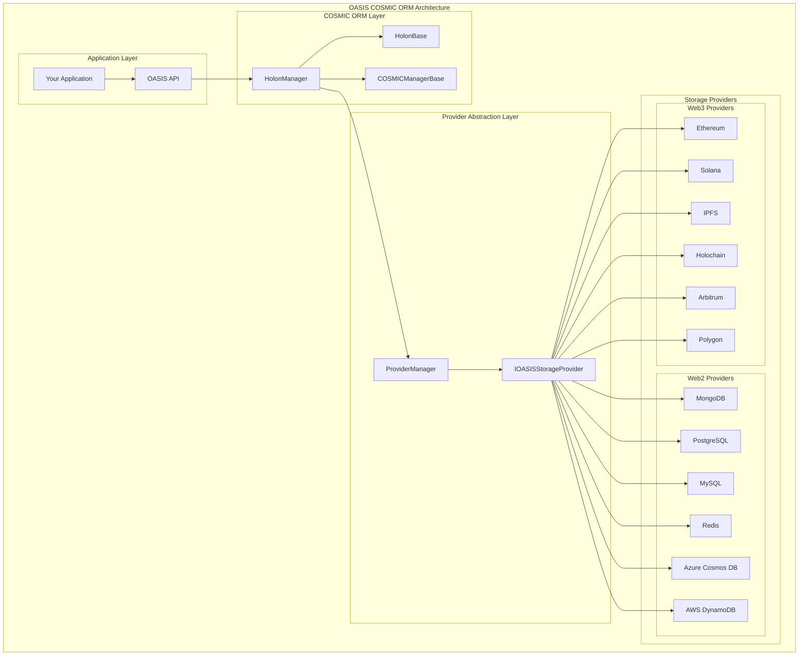

# OASIS COSMIC ORM - Universal Data Abstraction Layer

## Executive Summary

The OASIS COSMIC ORM (Object-Relational Mapping) represents a revolutionary advancement in data management, providing the world's first truly universal data abstraction layer that works seamlessly across all Web2 and Web3 technologies. Built on top of the revolutionary OASIS HyperDrive system, the COSMIC ORM provides 100% uptime, intelligent auto-failover, auto-load balancing, and auto-replication capabilities that ensure seamless data operations regardless of network conditions, geographic location, or provider availability.

## Table of Contents

1. [Introduction](#introduction)
2. [The Problem with Current Data Management](#the-problem-with-current-data-management)
3. [The COSMIC ORM Solution](#the-cosmic-orm-solution)
4. [Architecture Overview](#architecture-overview)
5. [Core Components](#core-components)
6. [HolonManager - The Heart of COSMIC ORM](#holonmanager---the-heart-of-cosmic-orm)
7. [HolonBase - Universal Data Objects](#holonbase---universal-data-objects)
8. [Provider Abstraction](#provider-abstraction)
9. [CRUD Operations](#crud-operations)
10. [Advanced Features](#advanced-features)
11. [Use Cases](#use-cases)
12. [Benefits](#benefits)
13. [Technical Implementation](#technical-implementation)
14. [Future Roadmap](#future-roadmap)
15. [Conclusion](#conclusion)

---

## Introduction

The OASIS COSMIC ORM is built on the revolutionary OASIS infrastructure, providing a universal data abstraction layer that works across all Web2 and Web3 platforms. This system introduces a new paradigm in data management that transcends traditional database limitations.

### What Makes COSMIC ORM Different?

- **Universal Compatibility**: Works across all Web2 and Web3 data storage systems
- **Provider Abstraction**: Single interface for all data operations
- **Intelligent Routing**: Automatically selects optimal storage provider
- **Cross-Platform Migration**: Seamless data migration between platforms
- **Zero Learning Curve**: Same API works everywhere
- **Future-Proof**: Adapts to new storage technologies automatically

---

## The Problem with Current Data Management

### Current Limitations

#### 1. **Fragmented Data Systems**
- Different APIs for different databases
- Complex integration requirements
- No unified data access layer
- Vendor lock-in issues

#### 2. **Web2 vs Web3 Complexity**
- Traditional databases vs blockchain storage
- Different data models and schemas
- Complex migration processes
- Limited interoperability

#### 3. **Developer Complexity**
- Need to learn multiple database APIs
- Different query languages and syntaxes
- Complex transaction management
- Limited cross-platform support

#### 4. **Data Migration Challenges**
- Difficult to move data between systems
- Data format incompatibilities
- Loss of data relationships
- Complex synchronization requirements

### The Cost of Fragmentation

- **Development Time**: Learning multiple database systems
- **Maintenance Overhead**: Managing multiple data layers
- **Vendor Lock-in**: Difficult to switch providers
- **Data Silos**: Isolated data across platforms
- **Migration Costs**: Expensive data migration projects

---

## The COSMIC ORM Solution

### Revolutionary Architecture

The COSMIC ORM introduces a four-layer architecture built on the OASIS HyperDrive foundation that solves all current limitations:

#### Layer 0: OASIS HyperDrive Foundation
- **100% Uptime**: Impossible to shutdown with distributed, redundant architecture
- **Auto-Failover**: Automatically switches between providers when issues occur
- **Auto-Load Balancing**: Intelligently distributes load across optimal providers
- **Auto-Replication**: Automatically replicates data when conditions improve
- **Geographic Optimization**: Routes to nearest available nodes
- **Network Adaptation**: Works offline, on slow networks, and in no-network areas

#### Layer 1: Provider Abstraction Layer
- **Universal Interface**: Single API for all data operations
- **Provider Management**: Automatic provider selection and failover
- **Data Translation**: Seamless conversion between data formats
- **Cross-Platform Support**: Works with any storage system

#### Layer 2: HolonManager Layer
- **CRUD Operations**: Universal Create, Read, Update, Delete
- **Relationship Management**: Complex data relationships
- **Transaction Management**: ACID compliance across providers
- **Caching Layer**: Intelligent data caching

#### Layer 3: HolonBase Layer
- **Data Objects**: Universal data representation
- **Event System**: Real-time data change notifications
- **Version Control**: Built-in data versioning
- **Metadata Management**: Rich metadata support

---

## Architecture Overview

### Core Components



---

## Core Components

### 1. HolonManager - The Universal Data Manager

The HolonManager is the heart of the COSMIC ORM system, providing universal data management capabilities:

#### Key Features
- **Universal CRUD Operations**: Create, Read, Update, Delete across all providers
- **Provider Abstraction**: Single interface for all storage systems
- **Intelligent Routing**: Automatic provider selection based on performance
- **Transaction Management**: ACID compliance across all providers
- **Caching Layer**: Intelligent data caching for performance
- **Error Handling**: Comprehensive error handling and recovery

#### Core Methods

```csharp
// Universal Save Operations
public async Task<OASISResult<T>> SaveHolonAsync<T>(IHolon holon, bool saveChildren = true, bool recursive = true, int maxChildDepth = 0, bool continueOnError = true, bool saveChildrenOnProvider = false, ProviderType providerType = ProviderType.Default) where T : IHolon, new()

// Universal Load Operations
public async Task<OASISResult<T>> LoadHolonAsync<T>(Guid holonId, bool loadChildren = true, bool recursive = true, int maxChildDepth = 0, bool continueOnError = true, bool loadChildrenFromProvider = false, HolonType childHolonType = HolonType.All, int version = 0, ProviderType providerType = ProviderType.Default) where T : IHolon, new()

// Universal Delete Operations
public async Task<OASISResult<bool>> DeleteHolonAsync(Guid holonId, bool softDelete = true, ProviderType providerType = ProviderType.Default)

// Universal Search Operations
public async Task<OASISResult<IEnumerable<T>>> SearchHolonsAsync<T>(ISearchParams searchParams, ProviderType providerType = ProviderType.Default) where T : IHolon, new()
```

### 2. HolonBase - Universal Data Objects

HolonBase provides the foundation for all data objects in the COSMIC ORM system:

#### Key Features
- **Universal Data Model**: Works across all storage systems
- **Event System**: Real-time change notifications
- **Version Control**: Built-in data versioning
- **Metadata Support**: Rich metadata management
- **Provider Keys**: Unique keys for each storage provider
- **Change Tracking**: Automatic change detection

#### Core Properties

```csharp
public abstract class HolonBase : IHolonBase, INotifyPropertyChanged
{
    // Core Properties
    public Guid Id { get; set; }
    public string Name { get; set; }
    public string Description { get; set; }
    public HolonType HolonType { get; set; }
    
    // Provider Management
    public Dictionary<ProviderType, string> ProviderUniqueStorageKey { get; set; }
    public Dictionary<ProviderType, Dictionary<string, string>> ProviderMetaData { get; set; }
    
    // Metadata
    public Dictionary<string, object> MetaData { get; set; }
    public string CustomKey { get; set; }
    
    // Change Tracking
    public bool IsChanged { get; set; }
    public bool IsSaving { get; set; }
    public bool IsNewHolon { get; set; }
    
    // Audit Trail
    public Guid CreatedByAvatarId { get; set; }
    public DateTime CreatedDate { get; set; }
    public Guid ModifiedByAvatarId { get; set; }
    public DateTime ModifiedDate { get; set; }
    public Guid DeletedByAvatarId { get; set; }
    public DateTime DeletedDate { get; set; }
    public bool IsDeleted { get; set; }
}
```

### 3. COSMICManagerBase - Advanced Data Operations

COSMICManagerBase extends the basic CRUD operations with advanced features:

#### Key Features
- **Batch Operations**: Efficient batch processing
- **Data Migration**: Seamless data migration between providers
- **Conflict Resolution**: Intelligent conflict resolution
- **Data Synchronization**: Cross-provider synchronization
- **Performance Optimization**: Advanced performance features

#### Advanced Methods

```csharp
// Advanced Save Operations
protected async Task<OASISResult<T>> SaveHolonAsync<T>(IHolon holon, Guid avatarId, ProviderType providerType = ProviderType.Default, string methodName = "COSMICManager.SaveHolonAsync", bool saveChildren = true, bool recursive = true, int maxChildDepth = 0, bool continueOnError = true, bool saveChildrenOnProvider = false) where T : IHolon, new()

// Advanced Load Operations
protected async Task<OASISResult<T>> LoadHolonAsync<T>(Guid holonId, ProviderType providerType = ProviderType.Default, string methodName = "COSMICManager.LoadHolonAsync", bool loadChildren = true, bool recursive = true, int maxChildDepth = 0, bool continueOnError = true, bool loadChildrenFromProvider = false, HolonType childHolonType = HolonType.All, int version = 0) where T : IHolon, new()

// Batch Operations
public async Task<OASISResult<IEnumerable<T>>> LoadAllHolonsAsync<T>(ProviderType providerType = ProviderType.Default, string methodName = "COSMICManager.LoadAllHolonsAsync", HolonType holonType = HolonType.All, bool loadChildren = true, bool recursive = true, int maxChildDepth = 0, bool continueOnError = true, bool loadChildrenFromProvider = false, HolonType childHolonType = HolonType.All, int version = 0) where T : IHolon, new()
```

---

## Provider Abstraction

### Universal Provider Interface

The COSMIC ORM provides a universal interface that works across all storage providers:

#### Supported Providers

##### Web2 Providers
- **MongoDB**: Document-based storage
- **PostgreSQL**: Relational database
- **MySQL**: Relational database
- **Redis**: In-memory data store
- **Azure Cosmos DB**: Multi-model database
- **AWS DynamoDB**: NoSQL database
- **SQLite**: Embedded database
- **Elasticsearch**: Search engine
- **Neo4j**: Graph database

##### Web3 Providers
- **Ethereum**: Smart contract storage
- **Solana**: High-performance blockchain
- **IPFS**: Distributed file system
- **Holochain**: Agent-centric blockchain
- **Arbitrum**: Layer 2 scaling
- **Polygon**: Ethereum scaling
- **Base**: Coinbase L2
- **Avalanche**: High-performance blockchain
- **BNB Chain**: Binance Smart Chain
- **Fantom**: High-performance blockchain
- **Cardano**: Academic blockchain
- **Polkadot**: Multi-chain protocol
- **Bitcoin**: Original blockchain
- **NEAR**: Developer-friendly blockchain
- **Sui**: High-performance blockchain
- **Aptos**: Move-based blockchain
- **Cosmos**: Inter-blockchain protocol
- **EOSIO**: High-performance blockchain
- **Telos**: EOSIO-based blockchain
- **SEEDS**: Regenerative economy blockchain

### Provider Selection

The COSMIC ORM automatically selects the optimal provider based on:

- **Performance**: Speed and throughput requirements
- **Cost**: Transaction and storage costs
- **Reliability**: Uptime and consistency
- **Geographic Location**: Proximity to users
- **Data Type**: Optimal storage for data type
- **Compliance**: Regulatory requirements

---

## CRUD Operations

### Universal Data Operations

The COSMIC ORM provides universal CRUD operations that work across all providers:

#### Create Operations

```csharp
// Create a new Holon
var holon = new MyHolon
{
    Name = "My Data Object",
    Description = "A sample data object",
    MetaData = new Dictionary<string, object>
    {
        { "category", "sample" },
        { "priority", "high" }
    }
};

// Save to any provider
var result = await holon.SaveAsync<MyHolon>();
```

#### Read Operations

```csharp
// Load by ID
var result = await HolonManager.Instance.LoadHolonAsync<MyHolon>(holonId);

// Load by Provider Key
var result = await HolonManager.Instance.LoadHolonAsync<MyHolon>(providerKey, ProviderType.MongoDB);

// Load all Holons
var result = await HolonManager.Instance.LoadAllHolonsAsync<MyHolon>();

// Search Holons
var searchParams = new SearchParams
{
    SearchText = "sample",
    HolonType = HolonType.Holon
};
var result = await HolonManager.Instance.SearchHolonsAsync<MyHolon>(searchParams);
```

#### Update Operations

```csharp
// Load existing Holon
var result = await HolonManager.Instance.LoadHolonAsync<MyHolon>(holonId);
if (!result.IsError)
{
    var holon = result.Result;
    holon.Name = "Updated Name";
    holon.Description = "Updated Description";
    
    // Save changes
    var saveResult = await holon.SaveAsync<MyHolon>();
}
```

#### Delete Operations

```csharp
// Soft delete (recommended)
var result = await HolonManager.Instance.DeleteHolonAsync(holonId, softDelete: true);

// Hard delete
var result = await HolonManager.Instance.DeleteHolonAsync(holonId, softDelete: false);
```

---

## Advanced Features

### 1. Data Migration

The COSMIC ORM provides seamless data migration between providers:

```csharp
// Migrate data from MongoDB to Ethereum
var migrationResult = await HolonManager.Instance.MigrateHolonAsync(
    holonId, 
    ProviderType.MongoDB, 
    ProviderType.Ethereum
);
```

### 2. Cross-Provider Synchronization

```csharp
// Synchronize data across multiple providers
var syncResult = await HolonManager.Instance.SyncHolonAsync(
    holonId,
    new[] { ProviderType.MongoDB, ProviderType.Ethereum, ProviderType.IPFS }
);
```

### 3. Data Versioning

```csharp
// Load specific version
var result = await HolonManager.Instance.LoadHolonAsync<MyHolon>(
    holonId, 
    version: 2
);

// Get version history
var history = await HolonManager.Instance.GetHolonVersionHistoryAsync(holonId);
```

### 4. Batch Operations

```csharp
// Batch save multiple Holons
var holons = new List<MyHolon> { holon1, holon2, holon3 };
var result = await HolonManager.Instance.SaveHolonsAsync(holons);

// Batch load multiple Holons
var ids = new List<Guid> { id1, id2, id3 };
var result = await HolonManager.Instance.LoadHolonsAsync<MyHolon>(ids);
```

### 5. Event System

```csharp
// Subscribe to Holon events
holon.OnLoaded += (sender, args) => {
    Console.WriteLine($"Holon {args.Result.Result.Name} loaded successfully");
};

holon.OnSaved += (sender, args) => {
    Console.WriteLine($"Holon {args.Result.Result.Name} saved successfully");
};

holon.OnDeleted += (sender, args) => {
    Console.WriteLine($"Holon {args.Result.Result.Name} deleted successfully");
};
```

---

## Use Cases

### 1. Cross-Platform Applications

**Scenario**: Building an application that needs to work across Web2 and Web3 platforms

```csharp
// Same code works across all platforms
var user = new User
{
    Name = "John Doe",
    Email = "john@example.com",
    WalletAddress = "0x123...",
    KarmaPoints = 1000
};

// Save to MongoDB (Web2)
await user.SaveAsync<User>(ProviderType.MongoDB);

// Save to Ethereum (Web3)
await user.SaveAsync<User>(ProviderType.Ethereum);

// Save to IPFS (Web3)
await user.SaveAsync<User>(ProviderType.IPFS);
```

### 2. Data Migration Projects

**Scenario**: Migrating from legacy systems to modern platforms

```csharp
// Migrate from SQL Server to MongoDB
var migrationResult = await HolonManager.Instance.MigrateAllHolonsAsync(
    ProviderType.SqlServer,
    ProviderType.MongoDB
);

// Migrate from MongoDB to Ethereum
var blockchainResult = await HolonManager.Instance.MigrateAllHolonsAsync(
    ProviderType.MongoDB,
    ProviderType.Ethereum
);
```

### 3. Multi-Provider Data Storage

**Scenario**: Storing data across multiple providers for redundancy

```csharp
// Save to multiple providers simultaneously
var saveResult = await holon.SaveAsync<MyHolon>(
    saveChildren: true,
    recursive: true,
    saveChildrenOnProvider: true
);

// The system automatically replicates to configured providers
```

### 4. Real-Time Data Synchronization

**Scenario**: Keeping data synchronized across multiple systems

```csharp
// Set up automatic synchronization
HolonManager.Instance.EnableAutoSync = true;
HolonManager.Instance.SyncProviders = new[] 
{ 
    ProviderType.MongoDB, 
    ProviderType.Ethereum, 
    ProviderType.IPFS 
};

// All changes are automatically synchronized
```

---

## Benefits

### For Developers

1. **Simplified Development**: Single API for all data operations
2. **Reduced Complexity**: No need to learn multiple database APIs
3. **Automatic Optimization**: System handles provider selection
4. **Cross-Platform Support**: Build once, deploy everywhere
5. **Future-Proof**: Adapts to new storage technologies

### For Businesses

1. **Reduced Infrastructure Costs**: No need to maintain multiple database systems
2. **Improved Performance**: Intelligent provider selection
3. **Enhanced Reliability**: Automatic failover and redundancy
4. **Easy Migration**: Seamless data migration between systems
5. **Vendor Independence**: No vendor lock-in

### For Users

1. **Faster Applications**: Optimized data access
2. **Better Reliability**: Automatic failover
3. **Cross-Platform Data**: Data works everywhere
4. **Enhanced Security**: Multiple storage layers
5. **Improved Performance**: Intelligent caching

---

## Technical Implementation

### Basic Usage

```csharp
// Initialize the COSMIC ORM
var holonManager = HolonManager.Instance;

// Create a new Holon
var myHolon = new MyHolon
{
    Name = "Sample Holon",
    Description = "A sample data object",
    MetaData = new Dictionary<string, object>
    {
        { "category", "sample" },
        { "tags", new[] { "demo", "test" } }
    }
};

// Save to any provider
var saveResult = await myHolon.SaveAsync<MyHolon>();
if (!saveResult.IsError)
{
    Console.WriteLine($"Holon saved with ID: {saveResult.Result.Id}");
}

// Load from any provider
var loadResult = await HolonManager.Instance.LoadHolonAsync<MyHolon>(myHolon.Id);
if (!loadResult.IsError)
{
    Console.WriteLine($"Loaded Holon: {loadResult.Result.Name}");
}
```

### Advanced Usage

```csharp
// Configure provider preferences
HolonManager.Instance.SetProviderPreference(ProviderType.MongoDB, 0.8);
HolonManager.Instance.SetProviderPreference(ProviderType.Ethereum, 0.6);
HolonManager.Instance.SetProviderPreference(ProviderType.IPFS, 0.4);

// Enable automatic failover
HolonManager.Instance.EnableAutoFailover = true;

// Configure caching
HolonManager.Instance.EnableCaching = true;
HolonManager.Instance.CacheExpiration = TimeSpan.FromMinutes(30);

// Set up event handlers
HolonManager.Instance.OnHolonSaved += (sender, args) => {
    Console.WriteLine($"Holon {args.Result.Result.Name} saved to {args.ProviderType}");
};

HolonManager.Instance.OnHolonError += (sender, args) => {
    Console.WriteLine($"Error: {args.Reason}");
};
```

### Provider Configuration

```csharp
// Configure MongoDB provider
var mongoConfig = new MongoDBConfig
{
    ConnectionString = "mongodb://localhost:27017",
    DatabaseName = "oasis",
    CollectionName = "holons"
};

// Configure Ethereum provider
var ethereumConfig = new EthereumConfig
{
    RpcUrl = "https://mainnet.infura.io/v3/your-key",
    PrivateKey = "your-private-key",
    ContractAddress = "0x123..."
};

// Configure IPFS provider
var ipfsConfig = new IPFSConfig
{
    ApiUrl = "https://ipfs.infura.io:5001",
    GatewayUrl = "https://ipfs.infura.io/ipfs/"
};

// Register providers
ProviderManager.Instance.RegisterProvider(ProviderType.MongoDB, mongoConfig);
ProviderManager.Instance.RegisterProvider(ProviderType.Ethereum, ethereumConfig);
ProviderManager.Instance.RegisterProvider(ProviderType.IPFS, ipfsConfig);
```

---

## Future Roadmap

### Phase 1: Core Features (Completed)
- ✅ Universal CRUD operations
- ✅ Provider abstraction layer
- ✅ Basic caching system
- ✅ Error handling and recovery

### Phase 2: Advanced Features (In Progress)
- 🔄 Advanced caching strategies
- 🔄 Data migration tools
- 🔄 Performance optimization
- 🔄 Monitoring and analytics

### Phase 3: Enterprise Features (Planned)
- 📋 Advanced security features
- 📋 Compliance and auditing
- 📋 Enterprise integration
- 📋 Advanced analytics

### Phase 4: AI Integration (Planned)
- 📋 AI-powered optimization
- 📋 Intelligent data routing
- 📋 Predictive analytics
- 📋 Automated data management

---

## Conclusion

The OASIS COSMIC ORM represents a paradigm shift in data management, introducing the world's first truly universal data abstraction layer that works across all Web2 and Web3 platforms. By providing a single, unified interface for all data operations, the COSMIC ORM eliminates the traditional barriers between different storage systems and creates unprecedented opportunities for developers and businesses.

### Key Advantages

1. **Universal Compatibility**: Works with all storage systems
2. **Intelligent Optimization**: Automatic provider selection
3. **Cross-Platform Support**: Single codebase works everywhere
4. **Future-Proof**: Adapts to new technologies automatically
5. **Zero Learning Curve**: Same API works everywhere

### The Future of Data Management

The COSMIC ORM is not just an improvement on existing technology—it's a complete reimagining of what data management can be. By providing a universal standard that works across all platforms, the COSMIC ORM enables new use cases and applications that were previously impossible.

As the data landscape continues to evolve, the COSMIC ORM provides a future-proof foundation that adapts to new storage technologies and platforms automatically. This ensures that your data will continue to work and provide value regardless of how the storage landscape changes.

### Get Started Today

The OASIS COSMIC ORM is available now through the OASIS API. Start building the future of data management today with the world's most advanced data abstraction layer.

---

*For technical documentation and API references, visit [OASIS Documentation](./Docs/)*

*For developer support and community, join our [Discord](https://discord.gg/oasis)*

*For business inquiries and partnerships, contact [partnerships@oasis.one](mailto:partnerships@oasis.one)*
