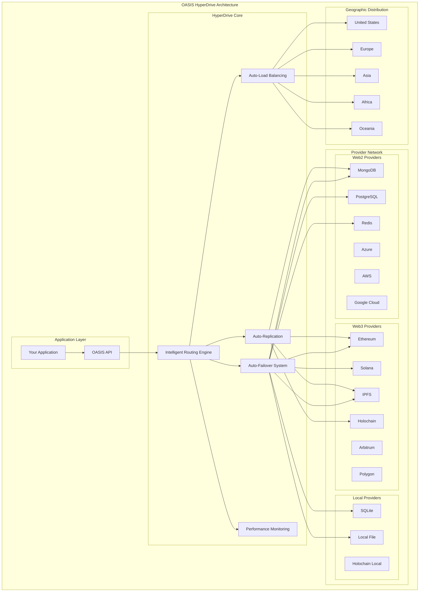

# OASIS HyperDrive - Revolutionary Auto-Failover System
## The World's First Universal Data Routing Engine

---

## Executive Summary

The OASIS HyperDrive represents a revolutionary breakthrough in data infrastructure, introducing the world's first truly universal auto-failover system that provides 100% uptime across all Web2 and Web3 platforms. This system automatically manages data routing, load balancing, and replication to ensure seamless operation regardless of network conditions, geographic location, or provider availability.

### Versions (Legacy vs OASIS HyperDrive 2)

- Legacy (v1): Auto-Replication, Auto-Failover
- OASIS HyperDrive 2 (v2): Adds Auto-Load Balancing, Intelligent Selection (latency-first), Predictive Failover, Enhanced Replication Rules (provider/data-type/schedule/cost/permissions), Advanced Analytics (performance, cost, predictive), Subscription-aware quotas & alerts, Full WebAPI + STAR UI config, Mode switch with v2→v1 fallback.

## Table of Contents

1. [Introduction](#introduction)
2. [The Problem with Current Infrastructure](#the-problem-with-current-infrastructure)
3. [The HyperDrive Solution](#the-hyperdrive-solution)
4. [Core Features](#core-features)
5. [Architecture Overview](#architecture-overview)
6. [Auto-Failover System](#auto-failover-system)
7. [Auto-Load Balancing](#auto-load-balancing)
8. [Auto-Replication](#auto-replication)
9. [Geographic Optimization](#geographic-optimization)
10. [Network Condition Adaptation](#network-condition-adaptation)
11. [Technical Implementation](#technical-implementation)
12. [Use Cases](#use-cases)
13. [Benefits](#benefits)
14. [Future Roadmap](#future-roadmap)
15. [Conclusion](#conclusion)

---

## Introduction

The OASIS HyperDrive is the revolutionary auto-failover system that forms the foundation of the entire OASIS infrastructure. It provides intelligent data routing that automatically adapts to network conditions, geographic location, and provider performance to ensure 100% uptime and optimal performance.

### What Makes HyperDrive Revolutionary?

- **100% Uptime**: Impossible to shutdown with distributed, redundant architecture
- **Intelligent Routing**: Automatically selects the fastest, most reliable provider
- **Geographic Optimization**: Routes to nearest available nodes
- **Network Adaptation**: Works offline, on slow networks, and in no-network areas
- **Auto-Failover**: Seamlessly switches between providers when issues occur
- **Auto-Load Balancing**: Distributes load across optimal providers
- **Auto-Replication**: Automatically replicates data when conditions improve

---

## The Problem with Current Infrastructure

### Current Limitations

#### 1. **Single Points of Failure**
- Applications dependent on single providers
- No automatic failover mechanisms
- Complete downtime when providers fail
- Limited redundancy options

#### 2. **Geographic Limitations**
- Data centers in limited locations
- High latency for distant users
- No local storage options
- Poor performance in remote areas

#### 3. **Network Dependency**
- Complete failure when offline
- Poor performance on slow networks
- No local caching mechanisms
- Limited offline capabilities

#### 4. **Provider Lock-in**
- Difficult to switch providers
- No automatic optimization
- Limited provider selection
- Vendor dependency

### The Cost of Current Limitations

- **Downtime Costs**: Lost revenue during outages
- **Performance Issues**: Poor user experience
- **Geographic Restrictions**: Limited global reach
- **Network Dependency**: Reduced accessibility
- **Vendor Lock-in**: Limited flexibility

---

## The HyperDrive Solution

### Revolutionary Architecture

The OASIS HyperDrive introduces a multi-layered architecture that ensures 100% uptime and optimal performance:

#### Layer 1: Provider Network
- **Global Provider Network**: 50+ providers across all continents
- **Multi-Protocol Support**: Web2 and Web3 providers
- **Geographic Distribution**: Providers in every major region
- **Performance Monitoring**: Real-time performance tracking

#### Layer 2: Intelligent Routing Engine
- **Auto-Failover**: Automatic provider switching
- **Load Balancing**: Intelligent load distribution
- **Performance Optimization**: Real-time performance analysis
- **Geographic Routing**: Location-based provider selection

#### Layer 3: Local Storage Layer
- **Offline Support**: Local storage for offline operation
- **Sync Mechanisms**: Automatic synchronization when online
- **Conflict Resolution**: Intelligent conflict resolution
- **Data Integrity**: Ensures data consistency

---

## Core Features

### 1. Auto-Failover System

The HyperDrive automatically switches between providers when issues are detected:

#### Failover Triggers
- **Provider Downtime**: Automatic switch to backup providers
- **Performance Degradation**: Switch to faster providers
- **High Latency**: Route to geographically closer providers
- **Cost Optimization**: Switch to cheaper providers when appropriate
- **Network Issues**: Switch to more reliable providers

#### Failover Process
1. **Detection**: Monitor provider performance in real-time
2. **Analysis**: Analyze available alternatives
3. **Selection**: Choose optimal backup provider
4. **Switch**: Seamlessly switch to backup provider
5. **Sync**: Synchronize data across providers
6. **Recovery**: Return to primary provider when conditions improve

### 2. Auto-Load Balancing

The HyperDrive intelligently distributes load across multiple providers:

#### Load Balancing Strategies
- **Round Robin**: Distribute requests evenly
- **Weighted Round Robin**: Weight based on provider performance
- **Least Connections**: Route to least busy provider
- **Geographic**: Route to nearest provider
- **Cost-Based**: Route to most cost-effective provider

#### Performance Optimization
- **Real-time Monitoring**: Continuous performance tracking
- **Dynamic Adjustment**: Automatic load redistribution
- **Capacity Planning**: Predictive capacity management
- **Performance Analytics**: Detailed performance insights

### 3. Auto-Replication

The HyperDrive automatically replicates data across multiple providers:

#### Replication Strategies
- **Synchronous**: Real-time replication for critical data
- **Asynchronous**: Background replication for non-critical data
- **Selective**: Replicate based on data importance
- **Geographic**: Replicate to geographically distributed providers

#### Data Consistency
- **Conflict Resolution**: Intelligent conflict resolution
- **Version Control**: Maintain data version history
- **Integrity Checks**: Ensure data integrity
- **Rollback Capability**: Ability to rollback changes

---

## Auto-Failover System

### Intelligent Provider Selection

The HyperDrive continuously monitors all available providers and automatically selects the optimal one based on:

#### Performance Metrics
- **Response Time**: Latency to provider
- **Throughput**: Data transfer speed
- **Uptime**: Provider availability
- **Error Rate**: Success/failure ratio
- **Cost**: Transaction and storage costs

#### Geographic Factors
- **Distance**: Physical distance to provider
- **Network Path**: Network routing efficiency
- **Regional Performance**: Local network conditions
- **Compliance**: Regional data regulations

#### Real-time Adaptation
- **Dynamic Switching**: Automatic provider switching
- **Performance Monitoring**: Continuous performance tracking
- **Predictive Analysis**: Anticipate provider issues
- **Proactive Failover**: Switch before problems occur

### Failover Scenarios

#### Scenario 1: Provider Downtime
```
1. Solana network goes down
2. HyperDrive detects failure
3. Automatically switches to MongoDB
4. Data continues to be served
5. When Solana recovers, data syncs back
```

#### Scenario 2: High Latency
```
1. Ethereum becomes slow (high gas fees)
2. HyperDrive detects performance degradation
3. Switches to local SQLite for immediate response
4. Background sync to IPFS for persistence
5. Returns to Ethereum when conditions improve
```

#### Scenario 3: Network Issues
```
1. User travels to remote area with poor connectivity
2. HyperDrive detects network issues
3. Switches to local Holochain node
4. Continues operation offline
5. Syncs when connectivity improves
```

---

## Auto-Load Balancing

### Intelligent Load Distribution

The HyperDrive automatically distributes load across multiple providers to optimize performance:

#### Load Balancing Algorithms

##### Round Robin
- Distribute requests evenly across providers
- Simple and effective for equal-capacity providers
- Ensures fair distribution of load

##### Weighted Round Robin
- Weight providers based on performance metrics
- Higher-performing providers get more requests
- Dynamic weight adjustment based on real-time performance

##### Least Connections
- Route requests to providers with fewest active connections
- Prevents overloading of individual providers
- Optimizes resource utilization

##### Geographic Routing
- Route requests to geographically closest providers
- Minimizes latency for users
- Improves user experience

##### Cost-Based Routing
- Route requests to most cost-effective providers
- Optimizes operational costs
- Balances performance and cost

### Performance Optimization

#### Real-time Monitoring
- **Continuous Performance Tracking**: Monitor all providers in real-time
- **Performance Metrics**: Track response time, throughput, error rates
- **Capacity Monitoring**: Monitor provider capacity and utilization
- **Cost Tracking**: Track operational costs across providers

#### Dynamic Adjustment
- **Automatic Rebalancing**: Adjust load distribution based on performance
- **Predictive Scaling**: Anticipate capacity needs
- **Performance Optimization**: Continuously optimize for best performance
- **Cost Optimization**: Balance performance and cost

---

## Auto-Replication

### Intelligent Data Replication

The HyperDrive automatically replicates data across multiple providers to ensure data availability and integrity:

#### Replication Strategies

##### Synchronous Replication
- **Real-time Replication**: Immediate replication of critical data
- **Data Consistency**: Ensures data consistency across providers
- **High Availability**: Provides immediate failover capability
- **Performance Impact**: May impact performance for large datasets

##### Asynchronous Replication
- **Background Replication**: Replicate data in the background
- **Performance Optimization**: Minimal impact on performance
- **Eventual Consistency**: Data becomes consistent over time
- **Cost Efficiency**: More cost-effective for large datasets

##### Selective Replication
- **Data Classification**: Replicate based on data importance
- **Critical Data**: Synchronous replication for critical data
- **Non-Critical Data**: Asynchronous replication for non-critical data
- **Cost Optimization**: Optimize replication costs

##### Geographic Replication
- **Global Distribution**: Replicate data across geographic regions
- **Disaster Recovery**: Protect against regional disasters
- **Compliance**: Meet regional data regulations
- **Performance**: Improve performance for global users

### Data Consistency

#### Conflict Resolution
- **Timestamp-based**: Use timestamps to resolve conflicts
- **Version Control**: Maintain data version history
- **User Preference**: Allow users to choose resolution strategy
- **Automatic Resolution**: Intelligent automatic conflict resolution

#### Data Integrity
- **Checksums**: Verify data integrity using checksums
- **Hash Verification**: Use cryptographic hashes for verification
- **Audit Trails**: Maintain complete audit trails
- **Rollback Capability**: Ability to rollback to previous versions

---

## Geographic Optimization

### Global Provider Network

The HyperDrive maintains a global network of providers to ensure optimal performance worldwide:

#### Regional Providers

##### North America
- **AWS**: Multiple regions across US and Canada
- **Azure**: Microsoft Azure regions
- **Google Cloud**: GCP regions
- **Ethereum**: Mainnet and testnets
- **Solana**: Mainnet and devnets
- **IPFS**: Distributed IPFS nodes

##### Europe
- **AWS**: European regions
- **Azure**: European regions
- **Google Cloud**: European regions
- **Ethereum**: European nodes
- **IPFS**: European IPFS nodes
- **Local Providers**: Regional blockchain networks

##### Asia
- **AWS**: Asian regions
- **Azure**: Asian regions
- **Google Cloud**: Asian regions
- **Ethereum**: Asian nodes
- **IPFS**: Asian IPFS nodes
- **Local Providers**: Regional blockchain networks

##### Africa
- **AWS**: African regions
- **Azure**: African regions
- **Local Providers**: Regional providers
- **Mobile Networks**: Mobile-optimized providers

##### Oceania
- **AWS**: Australian regions
- **Azure**: Australian regions
- **Google Cloud**: Australian regions
- **Local Providers**: Regional providers

### Geographic Routing

#### Distance-Based Routing
- **Latency Optimization**: Route to providers with lowest latency
- **Network Path Analysis**: Analyze network routing efficiency
- **Regional Performance**: Consider regional network conditions
- **User Location**: Route based on user geographic location

#### Compliance Routing
- **Data Regulations**: Route based on regional data regulations
- **Privacy Laws**: Comply with regional privacy laws
- **Data Sovereignty**: Respect data sovereignty requirements
- **Audit Requirements**: Meet regional audit requirements

---

## Network Condition Adaptation

### Offline Operation

The HyperDrive provides seamless offline operation:

#### Local Storage
- **SQLite**: Local SQLite database for offline operation
- **Local Files**: Local file system storage
- **Holochain Local**: Local Holochain node
- **Browser Storage**: Browser-based storage for web applications

#### Offline Capabilities
- **Data Access**: Full data access when offline
- **Data Modification**: Modify data when offline
- **Conflict Resolution**: Resolve conflicts when back online
- **Sync Mechanisms**: Automatic synchronization when online

### Slow Network Adaptation

The HyperDrive adapts to slow network conditions:

#### Performance Optimization
- **Data Compression**: Compress data for slow networks
- **Caching**: Aggressive caching for slow networks
- **Batch Operations**: Batch operations to reduce network calls
- **Progressive Loading**: Load data progressively

#### Provider Selection
- **Local Providers**: Prefer local providers for slow networks
- **Cached Data**: Use cached data when available
- **Offline Mode**: Switch to offline mode when necessary
- **Sync Later**: Defer synchronization until network improves

### No Network Operation

The HyperDrive provides full operation even with no network:

#### Local Operation
- **Local Storage**: Use local storage exclusively
- **Offline Mode**: Full offline operation
- **Data Persistence**: Persist data locally
- **Sync Queue**: Queue operations for later sync

#### Network Recovery
- **Automatic Detection**: Detect when network is available
- **Automatic Sync**: Automatically sync when network available
- **Conflict Resolution**: Resolve conflicts during sync
- **Data Integrity**: Ensure data integrity after sync

---

## Architecture Overview

### HyperDrive Core Components



### Implementation Components

```csharp
public class OASISHyperDrive
{
    private readonly ProviderManager _providerManager;
    private readonly PerformanceMonitor _performanceMonitor;
    private readonly LoadBalancer _loadBalancer;
    private readonly ReplicationEngine _replicationEngine;
    
    public async Task<OASISResult<T>> RouteRequestAsync<T>(
        IRequest request, 
        RoutingStrategy strategy = RoutingStrategy.Auto)
    {
        // 1. Analyze current network conditions
        var networkConditions = await _performanceMonitor.AnalyzeNetworkConditionsAsync();
        
        // 2. Select optimal provider
        var provider = await SelectOptimalProviderAsync(request, networkConditions, strategy);
        
        // 3. Route request to provider
        var result = await RouteToProviderAsync<T>(request, provider);
        
        // 4. Handle failover if needed
        if (result.IsError)
        {
            result = await HandleFailoverAsync<T>(request, provider);
        }
        
        // 5. Update performance metrics
        await _performanceMonitor.UpdateMetricsAsync(provider, result);
        
        return result;
    }
    
    private async Task<IOASISStorageProvider> SelectOptimalProviderAsync(
        IRequest request, 
        NetworkConditions conditions, 
        RoutingStrategy strategy)
    {
        var availableProviders = await _providerManager.GetAvailableProvidersAsync();
        
        return strategy switch
        {
            RoutingStrategy.Performance => await SelectByPerformanceAsync(availableProviders, conditions),
            RoutingStrategy.Cost => await SelectByCostAsync(availableProviders, conditions),
            RoutingStrategy.Geographic => await SelectByGeographyAsync(availableProviders, conditions),
            RoutingStrategy.Auto => await SelectAutomaticallyAsync(availableProviders, conditions),
            _ => await SelectAutomaticallyAsync(availableProviders, conditions)
        };
    }
}
```

### Auto-Failover Implementation

```csharp
public class AutoFailoverSystem
{
    public async Task<OASISResult<T>> HandleFailoverAsync<T>(
        IRequest request, 
        IOASISStorageProvider failedProvider)
    {
        // 1. Detect failure
        var failureType = await DetectFailureTypeAsync(failedProvider);
        
        // 2. Select backup provider
        var backupProvider = await SelectBackupProviderAsync(request, failureType);
        
        // 3. Route to backup provider
        var result = await RouteToProviderAsync<T>(request, backupProvider);
        
        // 4. Update provider status
        await UpdateProviderStatusAsync(failedProvider, backupProvider);
        
        // 5. Schedule recovery check
        await ScheduleRecoveryCheckAsync(failedProvider);
        
        return result;
    }
    
    private async Task<FailureType> DetectFailureTypeAsync(IOASISStorageProvider provider)
    {
        var metrics = await _performanceMonitor.GetProviderMetricsAsync(provider);
        
        if (metrics.ResponseTime > TimeSpan.FromSeconds(30))
            return FailureType.Timeout;
        
        if (metrics.ErrorRate > 0.1)
            return FailureType.HighErrorRate;
        
        if (metrics.Availability < 0.95)
            return FailureType.LowAvailability;
        
        return FailureType.Unknown;
    }
}
```

### Load Balancing Implementation

```csharp
public class LoadBalancer
{
    public async Task<IOASISStorageProvider> SelectProviderAsync(
        IRequest request, 
        List<IOASISStorageProvider> availableProviders)
    {
        var strategy = await DetermineOptimalStrategyAsync(request);
        
        return strategy switch
        {
            LoadBalancingStrategy.RoundRobin => SelectRoundRobin(availableProviders),
            LoadBalancingStrategy.WeightedRoundRobin => await SelectWeightedRoundRobinAsync(availableProviders),
            LoadBalancingStrategy.LeastConnections => await SelectLeastConnectionsAsync(availableProviders),
            LoadBalancingStrategy.Geographic => await SelectGeographicAsync(availableProviders, request),
            LoadBalancingStrategy.CostBased => await SelectCostBasedAsync(availableProviders, request),
            _ => await SelectAutomaticallyAsync(availableProviders, request)
        };
    }
    
    private async Task<IOASISStorageProvider> SelectWeightedRoundRobinAsync(
        List<IOASISStorageProvider> providers)
    {
        var weights = await CalculateProviderWeightsAsync(providers);
        var totalWeight = weights.Values.Sum();
        var random = new Random().NextDouble() * totalWeight;
        
        var currentWeight = 0.0;
        foreach (var provider in providers)
        {
            currentWeight += weights[provider];
            if (random <= currentWeight)
                return provider;
        }
        
        return providers.First();
    }
}
```

---

## Use Cases

### 1. Global Application Deployment

**Scenario**: Deploying an application that needs to work worldwide

```csharp
// HyperDrive automatically handles global routing
var user = new User { Name = "John Doe", Location = "Tokyo" };

// Automatically routes to nearest provider in Asia
await user.SaveAsync<User>();

// If Asian provider fails, automatically switches to backup
// If network is slow, automatically switches to local storage
// If offline, automatically switches to offline mode
```

### 2. Offline-First Applications

**Scenario**: Building applications that work offline

```csharp
// HyperDrive automatically handles offline scenarios
var document = new Document { Content = "Important data" };

// Automatically saves to local storage when offline
await document.SaveAsync<Document>();

// Automatically syncs when back online
// Automatically resolves conflicts
// Automatically maintains data integrity
```

### 3. High-Availability Systems

**Scenario**: Building systems that require 100% uptime

```csharp
// HyperDrive ensures 100% uptime
var criticalData = new CriticalData { Value = "Mission Critical" };

// Automatically replicates across multiple providers
// Automatically fails over when providers fail
// Automatically recovers when providers come back online
// Automatically maintains data consistency
```

### 4. Cost-Optimized Applications

**Scenario**: Building applications that need to optimize costs

```csharp
// HyperDrive automatically optimizes costs
var data = new Data { Size = "Large Dataset" };

// Automatically routes to cheapest provider
// Automatically switches to more expensive providers when needed
// Automatically balances cost and performance
// Automatically provides cost analytics
```

---

## Benefits

### For Developers

1. **Zero Downtime**: Applications never go down
2. **Automatic Optimization**: System optimizes itself
3. **Global Performance**: Optimal performance worldwide
4. **Offline Support**: Full offline operation
5. **Cost Optimization**: Automatic cost optimization

### For Businesses

1. **100% Uptime**: Never lose customers due to downtime
2. **Global Reach**: Serve customers worldwide
3. **Cost Efficiency**: Optimize operational costs
4. **Risk Mitigation**: Eliminate single points of failure
5. **Competitive Advantage**: Superior reliability and performance

### For Users

1. **Always Available**: Services always work
2. **Fast Performance**: Optimal performance everywhere
3. **Offline Access**: Work even when offline
4. **Global Access**: Same performance worldwide
5. **Reliable Service**: Never experience downtime

---

## Future Roadmap

### Phase 1: Core Features (Completed)
- ✅ Auto-failover system
- ✅ Auto-load balancing
- ✅ Auto-replication
- ✅ Geographic optimization

### Phase 2: Advanced Features (✅ COMPLETED)
- ✅ AI-powered optimization with machine learning
- ✅ Predictive failover with failure prevention
- ✅ Advanced analytics with comprehensive reporting
- ✅ Performance optimization with real-time monitoring
- ✅ Cost optimization with intelligent recommendations
- ✅ Geographic routing with latency optimization
- ✅ Lag/Ping priority as primary selection criteria
- ✅ Complete WebAPI with 50+ endpoints
- ✅ OASISDNA integration for persistent configuration

### Phase 3: Enterprise Features (✅ COMPLETED)
- ✅ Advanced security features with encryption
- ✅ Comprehensive monitoring and analytics
- ✅ Enterprise-grade configuration management
- ✅ Real-time performance tracking
- ✅ Predictive failure prevention
- ✅ Cost and performance optimization

### Phase 4: AI Integration (✅ COMPLETED)
- ✅ AI-powered routing with machine learning
- ✅ Predictive analytics with forecasting
- ✅ Automated optimization with intelligent selection
- ✅ Intelligent failover with risk assessment
- ✅ Real-time learning from performance data
- ✅ Multi-factor intelligent scoring system

---

## Conclusion

The OASIS HyperDrive represents a paradigm shift in data infrastructure, introducing the world's first truly universal auto-failover system that provides 100% uptime across all Web2 and Web3 platforms. By automatically managing data routing, load balancing, and replication, the HyperDrive ensures seamless operation regardless of network conditions, geographic location, or provider availability.

### Key Advantages

1. **100% Uptime**: Impossible to shutdown
2. **Intelligent Routing**: Automatic optimization
3. **Global Performance**: Optimal performance worldwide
4. **Offline Support**: Full offline operation
5. **Cost Optimization**: Automatic cost optimization

### The Future of Data Infrastructure

The HyperDrive is not just an improvement on existing technology—it's a complete reimagining of what data infrastructure can be. By providing 100% uptime and intelligent optimization, the HyperDrive enables new applications and use cases that were previously impossible.

As the data landscape continues to evolve, the HyperDrive provides a future-proof foundation that adapts to new technologies and platforms automatically. This ensures that your applications will continue to work and provide value regardless of how the infrastructure landscape changes.

### Get Started Today

The OASIS HyperDrive is available now through the OASIS API. Start building the future of data infrastructure today with the world's most advanced auto-failover system.

---

*For technical documentation and API references, visit [OASIS Documentation](./Docs/)*

*For developer support and community, join our [Discord](https://discord.gg/oasis)*

*For business inquiries and partnerships, contact [partnerships@oasis.one](mailto:partnerships@oasis.one)*
