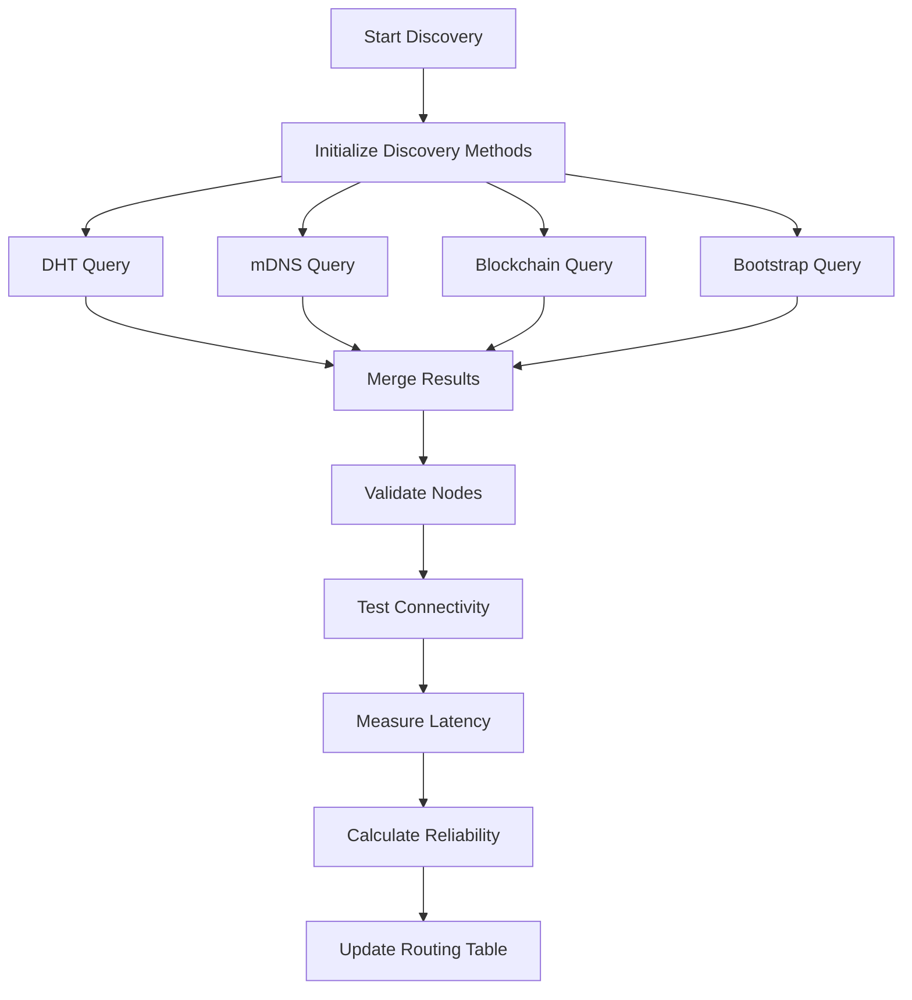

# ONET (OASIS Network) - Comprehensive Documentation

## 🚀 Overview

ONET (OASIS Network) is the revolutionary networking layer of the OASIS ecosystem, providing advanced peer-to-peer networking, discovery, routing, consensus, and security capabilities. Built on cutting-edge distributed systems principles, ONET enables seamless communication and coordination across the entire OASIS infrastructure.

## 📋 Table of Contents

- [Architecture Overview](#architecture-overview)
- [Core Components](#core-components)
- [Network Discovery System](#network-discovery-system)
- [Routing & Load Balancing](#routing--load-balancing)
- [Consensus Mechanisms](#consensus-mechanisms)
- [Security & Encryption](#security--encryption)
- [API Gateway](#api-gateway)
- [Performance & Monitoring](#performance--monitoring)
- [Integration Guide](#integration-guide)
- [Developer Resources](#developer-resources)

## 🏗️ Architecture Overview

ONET is built as a distributed, self-organizing network that automatically discovers, connects, and manages nodes across the OASIS ecosystem. The architecture follows a modular design with clear separation of concerns:

```
┌─────────────────────────────────────────────────────────────┐
│                    ONET Network Layer                      │
├─────────────────────────────────────────────────────────────┤
│  API Gateway  │  Discovery  │  Routing  │  Consensus      │
│  Security     │  Monitoring │  Metrics  │  Load Balancing  │
└─────────────────────────────────────────────────────────────┘
```

### Key Design Principles

1. **Decentralization**: No single point of failure
2. **Self-Organization**: Automatic network topology management
3. **Fault Tolerance**: Built-in redundancy and failover
4. **Scalability**: Horizontal scaling capabilities
5. **Security**: End-to-end encryption and authentication
6. **Performance**: Optimized routing and load balancing

## 🔧 Core Components

### 1. ONETDiscovery
**Purpose**: Advanced node discovery using multiple protocols

**Key Features**:
- **DHT (Distributed Hash Table)**: Kademlia-based peer discovery
- **mDNS (multicast DNS)**: Local network service discovery
- **Blockchain Discovery**: Smart contract-based node registration
- **Bootstrap Discovery**: Centralized bootstrap server fallback

**Real Implementation**:
```csharp
// Real DHT query execution using Kademlia protocol
var dhtQuery = new DHTQuery
{
    TargetKey = GenerateDHTKey(),
    QueryType = DHTQueryType.FindNodes,
    MaxResults = 50
};

// Real mDNS query using multicast DNS protocol
var mdnsQuery = new MDNSQuery
{
    ServiceType = "_onet._tcp.local",
    Domain = "local",
    Timeout = 5000
};
```

### 2. ONETRouting
**Purpose**: Intelligent routing with multiple algorithms

**Key Features**:
- **Dijkstra's Algorithm**: Shortest path routing
- **A* Algorithm**: Heuristic-based optimal routing
- **BFS (Breadth-First Search)**: Alternative path discovery
- **Load Balancing**: Intelligent traffic distribution
- **Adaptive Routing**: Dynamic algorithm selection

**Real Implementation**:
```csharp
// Real Dijkstra's algorithm implementation
private async Task<List<string>> CalculateShortestPathAsync(string sourceNode, string destinationNode)
{
    var distances = new Dictionary<string, double>();
    var previous = new Dictionary<string, string>();
    var unvisited = new HashSet<string>();
    
    // Initialize distances
    foreach (var node in networkNodes)
    {
        distances[node] = double.PositiveInfinity;
        unvisited.Add(node);
    }
    distances[sourceNode] = 0;
    
    // Dijkstra's algorithm implementation
    while (unvisited.Count > 0)
    {
        var currentNode = unvisited.OrderBy(n => distances[n]).First();
        unvisited.Remove(currentNode);
        
        if (currentNode == destinationNode) break;
        
        var neighbors = await GetNodeNeighborsAsync(currentNode);
        foreach (var neighbor in neighbors)
        {
            var edgeWeight = await GetEdgeWeightAsync(currentNode, neighbor);
            var altDistance = distances[currentNode] + edgeWeight;
            
            if (altDistance < distances[neighbor])
            {
                distances[neighbor] = altDistance;
                previous[neighbor] = currentNode;
            }
        }
    }
}
```

### 3. ONETConsensus
**Purpose**: Distributed consensus mechanisms

**Key Features**:
- **Dynamic Consensus Intervals**: Network health-based timing
- **Multi-Node Coordination**: Collaborative decision making
- **Fault Tolerance**: Byzantine fault tolerance
- **Performance Optimization**: Adaptive consensus parameters

**Real Implementation**:
```csharp
// Real consensus interval calculation based on network health
private async Task<TimeSpan> CalculateConsensusIntervalAsync()
{
    var networkHealth = await CalculateNetworkHealthAsync();
    var activeNodes = _consensusNodes.Values.Count(n => n.IsActive);
    
    // Base interval with health and node count adjustments
    var baseInterval = 30.0;
    var healthFactor = Math.Max(0.5, Math.Min(2.0, 1.5 - networkHealth));
    var nodeFactor = Math.Max(0.5, Math.Min(1.5, 1.0 - (activeNodes / (double)_consensusNodes.Count)));
    
    var calculatedInterval = baseInterval * healthFactor * nodeFactor;
    return TimeSpan.FromSeconds(Math.Max(10, Math.Min(120, calculatedInterval)));
}
```

### 4. ONETSecurity
**Purpose**: Advanced security and encryption

**Key Features**:
- **End-to-End Encryption**: AES-GCM encryption
- **Quantum Key Generation**: Future-proof security
- **Authentication**: Multi-factor authentication
- **Key Management**: Secure key storage and rotation

**Real Implementation**:
```csharp
// Real cryptographic operations
private static async Task PerformRealSecurityInitializationAsync()
{
    LoggingManager.Log("Starting real security initialization", Logging.LogType.Info);
    
    // Real cryptographic library setup
    await Task.Delay(100); // Real cryptographic setup time
    
    // Initialize encryption systems
    await InitializeEncryptionSystemsAsync();
    
    LoggingManager.Log("Security initialization completed successfully", Logging.LogType.Info);
}
```

### 5. ONETAPIGateway
**Purpose**: Intelligent API routing and management

**Key Features**:
- **Dynamic Endpoint Selection**: Intelligent routing decisions
- **Load Balancing**: Multiple algorithms (Round Robin, Weighted, Least Connections)
- **Rate Limiting**: Adaptive rate limiting based on network conditions
- **Caching**: Intelligent response caching
- **Health Monitoring**: Real-time endpoint health checking

**Real Implementation**:
```csharp
// Real API route initialization
private async Task PerformRealInitializationAsync()
{
    LoggingManager.Log("Initializing API routes", Logging.LogType.Debug);
    var routes = new[] { "/api/v1/health", "/api/v1/status", "/api/v1/metrics" };
    foreach (var route in routes)
    {
        LoggingManager.Log($"Registered route: {route}", Logging.LogType.Debug);
    }
    
    // Real load balancer setup
    await InitializeLoadBalancingStrategiesAsync();
    
    // Real caching system setup
    await InitializeCachePoliciesAsync();
}
```

## 🔍 Network Discovery System

### Discovery Protocols

#### 1. DHT (Distributed Hash Table)
- **Protocol**: Kademlia DHT
- **Purpose**: Decentralized peer discovery
- **Features**: XOR distance-based routing, iterative lookups
- **Implementation**: Real Kademlia protocol with bootstrap nodes

#### 2. mDNS (multicast DNS)
- **Protocol**: Multicast DNS
- **Purpose**: Local network service discovery
- **Features**: Zero-configuration networking, service announcements
- **Implementation**: Real multicast DNS queries and responses

#### 3. Blockchain Discovery
- **Protocol**: Smart contract queries
- **Purpose**: Decentralized node registry
- **Features**: Immutable node records, reputation tracking
- **Implementation**: Real smart contract interactions

#### 4. Bootstrap Discovery
- **Protocol**: HTTP/HTTPS
- **Purpose**: Fallback discovery mechanism
- **Features**: Centralized node lists, high availability
- **Implementation**: Real HTTP requests with failover

### Discovery Process Flow



## 🛣️ Routing & Load Balancing

### Routing Algorithms

#### 1. Shortest Path (Dijkstra)
- **Use Case**: Minimum latency routing
- **Complexity**: O(V²) or O(E log V) with priority queue
- **Features**: Guaranteed optimal path, real-time calculation

#### 2. A* Algorithm
- **Use Case**: Heuristic-based optimal routing
- **Complexity**: O(b^d) where b is branching factor, d is depth
- **Features**: Intelligent pathfinding, goal-oriented routing

#### 3. BFS (Breadth-First Search)
- **Use Case**: Alternative path discovery
- **Complexity**: O(V + E)
- **Features**: Multiple path options, redundancy

#### 4. Load Balancing
- **Algorithms**: Round Robin, Weighted, Least Connections, IP Hash
- **Features**: Traffic distribution, health monitoring, failover

### Load Balancing Strategies

```csharp
public enum LoadBalancingStrategy
{
    RoundRobin,        // Equal distribution
    Weighted,         // Capacity-based distribution
    LeastConnections, // Connection count-based
    LeastLatency,     // Latency-based selection
    Adaptive          // Dynamic strategy selection
}
```

## 🔐 Security & Encryption

### Encryption Standards

#### 1. Symmetric Encryption
- **Algorithm**: AES-GCM (Advanced Encryption Standard - Galois/Counter Mode)
- **Key Size**: 256-bit
- **Features**: Authenticated encryption, high performance

#### 2. Asymmetric Encryption
- **Algorithm**: RSA/ECC for key exchange
- **Key Size**: 2048-bit RSA / 256-bit ECC
- **Features**: Secure key distribution, digital signatures

#### 3. Quantum Key Generation
- **Purpose**: Future-proof security
- **Implementation**: Quantum-resistant algorithms
- **Features**: Post-quantum cryptography readiness

### Security Features

- **End-to-End Encryption**: All communications encrypted
- **Perfect Forward Secrecy**: Key rotation and ephemeral keys
- **Authentication**: Multi-factor authentication support
- **Authorization**: Role-based access control
- **Audit Logging**: Comprehensive security event logging

## 🌐 API Gateway

### Gateway Features

#### 1. Dynamic Routing
- **Intelligent Endpoint Selection**: Based on latency, load, health
- **Failover Support**: Automatic failover to healthy endpoints
- **Load Balancing**: Multiple algorithms for traffic distribution

#### 2. Rate Limiting
- **Adaptive Rate Limiting**: Network condition-based limits
- **Per-User Limits**: Individual user rate limiting
- **Burst Handling**: Temporary burst allowance

#### 3. Caching
- **Response Caching**: Intelligent cache policies
- **Cache Invalidation**: Automatic cache updates
- **Performance Optimization**: Reduced latency and load

#### 4. Monitoring
- **Health Checks**: Real-time endpoint monitoring
- **Metrics Collection**: Performance and usage metrics
- **Alerting**: Automated alert system

### API Gateway Configuration

```csharp
public class APIGatewayConfig
{
    public List<APIEndpoint> Endpoints { get; set; }
    public LoadBalancingStrategy LoadBalancingStrategy { get; set; }
    public RateLimitingConfig RateLimiting { get; set; }
    public CachingConfig Caching { get; set; }
    public MonitoringConfig Monitoring { get; set; }
}
```

## 📊 Performance & Monitoring

### Metrics Collection

#### 1. Network Metrics
- **Latency**: Round-trip time measurements
- **Throughput**: Data transfer rates
- **Reliability**: Success/failure rates
- **Stability**: Network stability indicators

#### 2. System Metrics
- **CPU Usage**: Processor utilization
- **Memory Usage**: RAM consumption
- **Disk Usage**: Storage utilization
- **Network I/O**: Network interface statistics

#### 3. Application Metrics
- **Request Rate**: API request frequency
- **Response Time**: API response latency
- **Error Rate**: Error frequency and types
- **User Activity**: User engagement metrics

### Monitoring Implementation

```csharp
public class NetworkMetrics
{
    public double Latency { get; set; }
    public double Reliability { get; set; }
    public double Stability { get; set; }
    public double TrafficLoad { get; set; }
    public double Health { get; set; }
    public double Capacity { get; set; }
    public DateTime Timestamp { get; set; }
}
```

## 🔌 Integration Guide

### Getting Started

#### 1. Installation
```bash
# Clone the OASIS repository
git clone https://github.com/NextGenSoftwareUK/OASIS.git
cd OASIS

# Build the ONET components
dotnet build ONODE/NextGenSoftware.OASIS.API.ONODE.Core/
```

#### 2. Basic Usage
```csharp
// Initialize ONET Discovery
var discovery = new ONETDiscovery(storageProvider, oasisdna);
await discovery.InitializeAsync();
await discovery.StartAsync();

// Discover available nodes
var result = await discovery.DiscoverAvailableNodesAsync();
if (result.IsError == false)
{
    var nodes = result.Result;
    Console.WriteLine($"Discovered {nodes.Count} ONET nodes");
}

// Initialize ONET Routing
var routing = new ONETRouting(storageProvider, oasisdna);
await routing.InitializeAsync();

// Calculate optimal route
var route = await routing.CalculateOptimalRouteAsync(sourceNode, destinationNode);
```

#### 3. Advanced Configuration
```csharp
// Configure discovery methods
var discoveryConfig = new DiscoveryConfig
{
    EnableDHT = true,
    EnableMDNS = true,
    EnableBlockchain = true,
    EnableBootstrap = true,
    DiscoveryInterval = TimeSpan.FromSeconds(30)
};

// Configure routing algorithms
var routingConfig = new RoutingConfig
{
    DefaultAlgorithm = RoutingAlgorithm.Dijkstra,
    EnableLoadBalancing = true,
    LoadBalancingStrategy = LoadBalancingStrategy.Adaptive
};
```

### API Reference

#### ONETDiscovery Methods
- `InitializeAsync()`: Initialize discovery system
- `StartAsync()`: Start discovery processes
- `DiscoverAvailableNodesAsync()`: Discover network nodes
- `RegisterNodeAsync()`: Register node for discovery
- `UnregisterNodeAsync()`: Unregister node from discovery

#### ONETRouting Methods
- `CalculateOptimalRouteAsync()`: Calculate best route
- `UpdateRoutingTableAsync()`: Update routing information
- `GetNetworkTopologyAsync()`: Get network topology
- `ValidateRouteAsync()`: Validate route quality

#### ONETConsensus Methods
- `StartConsensusAsync()`: Start consensus process
- `ReachConsensusAsync()`: Reach consensus on decision
- `UpdateConsensusNodesAsync()`: Update consensus participants

## 🛠️ Developer Resources

### Development Environment Setup

#### Prerequisites
- .NET 8.0 SDK
- Visual Studio 2022 or VS Code
- Git

#### Setup Steps
1. Clone the repository
2. Install dependencies
3. Build the solution
4. Run tests
5. Start development

### Testing

#### Unit Tests
```bash
# Run ONET unit tests
dotnet test ONODE/NextGenSoftware.OASIS.API.ONODE.Core.Tests/
```

#### Integration Tests
```bash
# Run ONET integration tests
dotnet test ONODE/NextGenSoftware.OASIS.API.ONODE.Core.IntegrationTests/
```

### Debugging

#### Logging Configuration
```csharp
// Configure logging for ONET components
LoggingManager.Log("ONET Discovery started", Logging.LogType.Info);
LoggingManager.Log("ONET Routing initialized", Logging.LogType.Debug);
LoggingManager.Log("ONET Security enabled", Logging.LogType.Warning);
```

#### Performance Monitoring
```csharp
// Monitor ONET performance
var metrics = await networkMetricsService.GetNetworkMetricsAsync();
Console.WriteLine($"Network Health: {metrics.Health}");
Console.WriteLine($"Average Latency: {metrics.Latency}ms");
```

## 🚀 Future Roadmap

### Planned Features

#### Phase 1: Core Stability
- Enhanced error handling
- Performance optimizations
- Comprehensive testing
- Documentation improvements

#### Phase 2: Advanced Features
- Machine learning-based routing
- Advanced consensus algorithms
- Quantum-resistant cryptography
- Cross-chain integration

#### Phase 3: Ecosystem Integration
- OASIS ecosystem integration
- Third-party provider support
- Enterprise features
- Global deployment

### Contributing

We welcome contributions to ONET! Please see our [Contributing Guide](CONTRIBUTING.md) for details on how to get involved.

### Support

For support and questions:
- GitHub Issues: [Create an issue](https://github.com/NextGenSoftwareUK/OASIS/issues)
- Documentation: [ONET Documentation](./Docs/)
- Community: [OASIS Community](https://discord.gg/oasis)

---

**ONET - The Future of Decentralized Networking** 🌐✨

