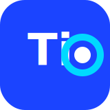
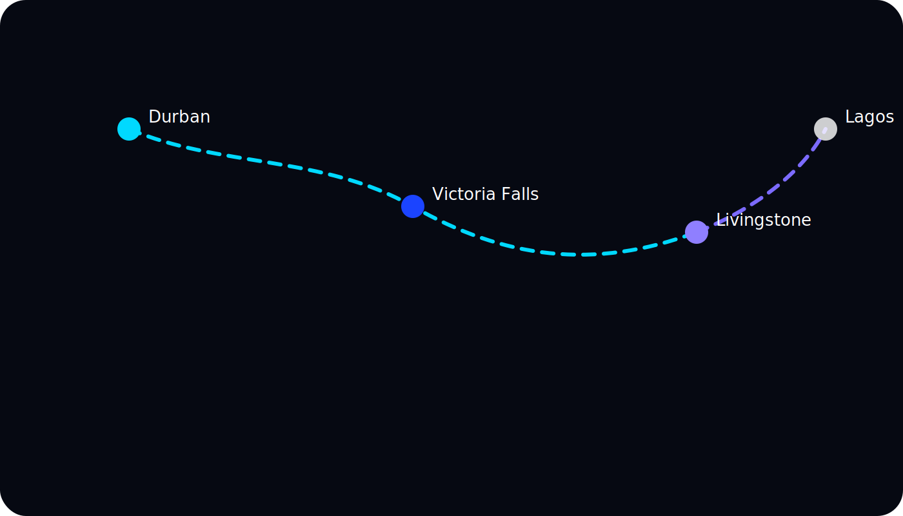
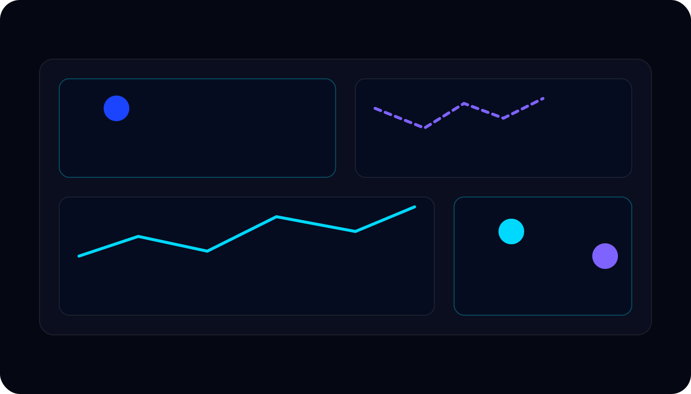

marp: true
theme: Docs/Presentations/TimoRidesDeck/themes/timo.css
paginate: true
title: Timo Rides Investor Deck
description: Africa-first next generation mobility platform
---

<!-- class: title-slide -->

  
  <strong>Timo Rides</strong>

# Powering trusted tourism mobility

Africa-first, next generation mobility platform

- Presenter · Role · Date
- Contact · hello@timo.africa

---

## Agenda

  

    
01

    

      <strong>Opportunity</strong> 
      Tourism mobility gaps across Africa
    

  

  

    
02

    

      <strong>Solution</strong> 
      Product experience &amp; tech differentiation
    

  

  

    
03

    

      <strong>Growth</strong> 
      Traction, monetisation, roadmap
    

  

  

    
04

    

      <strong>Partner with us</strong> 
      Team, funding ask, next steps
    

  

---

<!-- class: section-divider -->

## 01 · Opportunity

**Redefining how the world moves across Africa’s tourism cities.**

---

## Our North Star

> “Redefining how the world moves across Africa’s tourism cities.”

- Focus on **differentiation**, **scalability**, and disciplined **unit economics**
- Pilot validated: `10K` riders · `500` drivers · `5K` rides · `ZAR 350K` revenue
- Path to `USD $1–2M ARR` by 2027 with a targeted beachhead rollout

---

## Pain Points We Solve

- 3.3M visitors in Durban; 60% rely on ad-hoc taxis and informal transport
- Fragmented supply, low trust, inconsistent pricing for premium travellers
- Tourism boards lack data visibility on mobility quality and safety

  Trust deficit
  Fragmented supply
  No data layer

---

<!-- class: grid-2 -->

## Rule of One Beachhead Strategy

- **Goal** · Capture 1% of Durban tourism mobility spend (`$500K GMV`)
- **Market** · Durban, South Africa; `>$50M` tourism mobility gap
- **Expansion Path** · Durban → Victoria Falls → Livingstone → Lagos

---
class: section-divider

## 02 · Solution & Product

**Trusted, customisable rides with a data-rich technology stack.**

---

<!-- class: columns-3 -->

## Key Differentiators

  

    <h3>Choice</h3>
    
Scheduled rides, vehicle &amp; driver selection, concierge experience.

  

  

    <h3>Tourism focus</h3>
    
Embedded with hotels, airports, airlines, tourism boards.

  

  

    <h3>Interoperability</h3>
    
API-first stack connecting Web2 + Web3 systems.

  

  

    <h3>Identity &amp; Trust</h3>
    
Zero-knowledge KYC, cashless flows, verified supply.

  

---

<!-- class: grid-2 -->

## Technical Differentiation

  

    <h3>Interoperable Stack</h3>
    <ul>
      <li>Identity, resilience, interoperability built into the core.</li>
      <li>Government + partner integrations for compliance and data.</li>
    </ul>
  

  

    <h3>Built for Africa</h3>
    <ul>
      <li>Offline-ready, Bluetooth fallbacks, auto-failover infrastructure.</li>
      <li>Mobile money + stablecoin support; credentialed riders &amp; drivers.</li>
    </ul>
  

---

<!-- class: grid-2 -->

## Next-Generation Integrations

  

    <h3>Data-as-a-Service</h3>
    <ul>
      <li>Real-time traffic telemetry enriches AI models.</li>
      <li>Monetisable network intelligence for cities and partners.</li>
    </ul>
  

  

    <h3>Zero Knowledge KYC</h3>
    <ul>
      <li>Privacy-preserving verification removes fake accounts.</li>
      <li>Unlocks insurance, finance, and loyalty products.</li>
    </ul>
  

---

## Product Experience

- Riders schedule in advance, select vehicles, review drivers
- Tourism operators embed Timo portals with revenue sharing
- Corporates gain visibility on who moves executives & VIPs

---

## Why We Win

| Dimension | Timo | Others | Why it matters |
| --- | --- | --- | --- |
| Choice | Personalised, scheduled rides | Limited customisation | Premium travellers demand reliability |
| Tourism focus | Institutional partnerships | Primarily B2C | Low CAC, high retention |
| Interoperability | API-first, Web2/Web3 | Closed or manual | Rapid partner scaling |
| Commission ecosystem | Revenue share + data | Transaction-only | Aligns incentives |

---
class: section-divider

## 03 · Growth & Traction

**Scaling from Durban to a pan-African mobility network.**

---

## Tourism Cities Pipeline

  

    <strong>Durban (launch)</strong> 
    500 drivers · hotel + airport anchors
  

  

    <strong>Victoria Falls</strong> 
    Safari &amp; adventure corridor · cross-border tourism
  

  

    <strong>Livingstone</strong> 
    Zambia gateway · hospitality + events
  

  

    <strong>Lagos (exploratory)</strong> 
    Business tourism · airport + hotel networks
  

---

## Financial Glidepath

  

    
Pilot GMV

    
$0.5M

  

  

    
FY25 GMV

    
$3M

  

  

    
FY27 ARR

    
$2M

  

- 70%+ gross margins via commissions + data + identity services
- Partner-funded acquisition keeps CAC low with fast payback
- Stablecoin settlement and embedded finance extend LTV

---

## Traction & Partnerships

- MOU with Durban hotels, airport authority, tourism board
- Channel partners: tour operators, executive transport, concierge desks
- Digital alliances: mobile money providers, travel marketplaces, event tech
- Government integration via PathPulse road intelligence rollout

---

## Road Intelligence Layer

- Every vehicle becomes a data node with smartphone + dashcam
- City dashboards improve routing, safety, congestion planning

---

## Monetisation Stack

  

    <strong>Core Rides</strong> 
    Premium ride commissions; enterprise subscriptions
  

  

    <strong>Data Services</strong> 
    Traffic telemetry, tourism insights, dynamic pricing APIs
  

  

    <strong>Identity &amp; Trust</strong> 
    ZK KYC, safe-driver incentives, insurance partnerships
  

  

    <strong>Finance Layer</strong> 
    Stablecoin settlement, corporate wallets, loyalty
  

---

## Go-To-Market Execution

1. **Secure city anchors**: hotels, airports, tourism boards
2. **Launch curated driver guilds** with SLAs and ratings
3. **Embed booking widgets** across partner portals & apps
4. **Activate concierge + travel agents** with revenue share
5. **Scale data services** leveraging PathPulse + API tiering

---
class: section-divider

## 04 · Partner With Us

**Team, capital, and roadmap to own tourism mobility.**

---

## Ask & Use of Funds

- Seed round accelerates Durban densification + two new city launches
- Invest in AI routing, ZK identity, interoperability tooling
- Working capital for driver onboarding, insurance, customer success

---

## Team Snapshot

  

    <strong>Founder &amp; CEO</strong> 
    10+ years mobility + smart-city strategy; ex global ride-share
  

  

    <strong>COO</strong> 
    Former tourism operator; scaled logistics teams across SADC
  

  

    <strong>CTO</strong> 
    Built interoperable Web2/Web3 infrastructure in Africa
  

  

    <strong>Advisors</strong> 
    Hospitality networks, transport regulation, fintech
  

---

## Closing

> “Let’s ride the future of African tourism together.”

Team Timo · hello@timo.africa

- Building the trusted mobility layer for tourism cities
- Differentiated tech stack + data intelligence + deep partnerships
- Ready to scale beyond Durban with the right strategic capital

