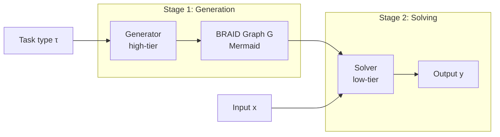

# Holonic BRAID: Lite Paper

**How shared reasoning graphs improve on BRAID at scale**

OASIS / NextGen Software · January 2026

---

## Abstract

**Holonic BRAID** combines OpenSERV’s BRAID (Bounded Reasoning for Autonomous Inference and Decisions) [1] with OASIS’s holonic architecture so that many agents share one reasoning-graph library. BRAID uses bounded, Mermaid-based instruction graphs instead of unbounded natural-language chain-of-thought; Amçalar & Cinar show that structured machine-readable prompts substantially increase **reasoning accuracy** and **cost efficiency** on GSM-Hard, SCALE MultiChallenge, and AdvancedIF, and that encoding steps in symbolic form yields the same level of **accuracy and consistency** with low-capacity models as with larger models [1]. The paper reports substantial PPD gains—e.g. efficiency gains of 30× on procedural tasks and up to 74× on mathematical reasoning for a reported configuration (gpt-4.1→gpt-5-nano-minimal on GSM-Hard, PPD 74.06 vs baseline) [1]. At scale, BRAID without sharing loses most of that gain because each agent or run pays for graph generation. Holonic BRAID stores graphs as **holons** in a shared, persistent library: each graph is generated once per task type and reused by all agents, and holons are replicated across storage providers (e.g. MongoDB, Solana, IPFS) so the same graph is available regardless of which chain or backend an agent uses. This restores large PPD gains at scale and extends BRAID’s consistency and accuracy by reuse of validated graphs, accuracy-ranked selection, and versioning. This lite paper defines the model, gives cost and PPD equations, explains holons and how they work across providers and chains, states how Holonic BRAID improves consistency and accuracy, and provides technical diagrams.

---

## 1. Introduction

### 1.1 Motivation

BRAID [1] gives large PPD gains vs a GPT-5-medium baseline when the solver uses a pre-built reasoning graph; the paper reports efficiency gains of 30× on procedural tasks and up to 74× on mathematical reasoning for selected configurations. At scale (many agents, many tasks), BRAID without sharing pays for graph generation per agent or per task, so PPD vs the baseline collapses. Holonic BRAID adds a **shared graph library** whose graphs are stored as **holons**—replicated across storage providers so the same graph is available to any agent on any chain or backend. The system then pays for each graph once per task type and preserves large PPD gains at scale.

### 1.2 Contribution

We define the Holonic BRAID model and its cost structure, explain how holons work across storage providers and chains, and show how Holonic BRAID extends BRAID’s accuracy and consistency gains at scale. Specifically, we:

1. State the **cost and PPD equations** for the GPT-5-medium baseline, BRAID, and Holonic BRAID.
2. Explain **holons** in enough detail to show how the same graph is available to any agent on any chain or backend.
3. Explain **how Holonic BRAID improves on BRAID** (sharing, persistence, consistency/accuracy at scale).
4. Provide **technical diagrams** for the two-stage BRAID protocol, holon-backed graph library, and end-to-end Holonic BRAID flow.

---

## 2. BRAID: Bounded Reasoning

We summarize BRAID [1] only as needed for Holonic BRAID. BRAID separates **prompt generation** from **prompt solving**:

- **Stage 1 (Generator):** A high-tier model produces a **reasoning graph** (Mermaid flowchart) that encodes the reasoning topology for a task type.
- **Stage 2 (Solver):** A low-tier model **executes** the graph on concrete inputs; it follows the graph instead of doing free-form reasoning.

**Insight (BRAID paper [1]):** *Reasoning performance = Model capacity × Prompt structure.* By constraining the reasoning path to deterministic logical flows expressed in Mermaid diagrams, BRAID reduces “reasoning drift” (off-topic or repetitive text) and yields the same level of accuracy and consistency with low-capacity models as with larger, state-of-the-art models. The paper evaluates BRAID on GSM-Hard, SCALE MultiChallenge, and AdvancedIF; structured machine-readable prompts substantially increase reasoning accuracy and cost efficiency.

### 2.2 Two-Stage Protocol (Diagram)

```
┌─────────────────────────────────────────────────────────────────┐
│                    BRAID TWO-STAGE PROTOCOL                      │
└─────────────────────────────────────────────────────────────────┘

  Stage 1: Prompt Generation              Stage 2: Prompt Solving
  ─────────────────────────               ─────────────────────

  ┌─────────────────┐                      ┌─────────────────┐
  │  High-tier      │   Mermaid graph     │  Low-tier       │
  │  Generator      │ ──────────────────►│  Solver         │
  │  (e.g. gpt-5-   │   flowchart TD;     │  (e.g. gpt-5-   │
  │   medium)       │   A → B → C → ...   │   nano-minimal) │
  └────────┬────────┘                      └────────┬────────┘
           │                                        │
           │  one-time cost                         │  per-task cost
           │  (amortized over                       │  (bounded by graph)
           │   many solves)                         │
           ▼                                        ▼
  ┌─────────────────┐                      ┌─────────────────┐
  │  BRAID Graph G   │                      │  Output y       │
  │  G = Gen(τ)      │   Solver(G, x)      │  y = Solve(G,x) │
  │  τ = task type   │ ──────────────────► │  x = input      │
  └─────────────────┘                      └─────────────────┘
```

### 2.3 BRAID Cost and PPD (Single Run)

**Notation**

- **C_gen** = cost per graph generation (high-tier model)
- **C_solve** = cost per solve step (low-tier model)
- **C_GPT5** = cost per task for GPT-5 default (monolithic)

**Single run:** one graph *G* for task type *τ*, then *T* solves.

**Cost:**

```
Cost_BRAID(T) = C_gen + T · C_solve
```

**PPD (performance per dollar) vs GPT-5 baseline:** same *T* tasks, so

```
PPD_BRAID(T) = (C_GPT5 · T) / Cost_BRAID(T) = (C_GPT5 · T) / (C_gen + T · C_solve)
```

**Illustrative regime:** When one graph serves many tasks, C_gen is amortized. For *T* = 100 and the cost regime used in [1], BRAID’s PPD can reach values far above the baseline; the paper reports one configuration (gpt-4.1→gpt-5-nano-minimal on GSM-Hard) at PPD 74.06 [1]. In general, **BRAID yields large PPD gains** when one graph serves many tasks; the exact multiplier depends on model pair, dataset, and cost assumptions.

### 2.4 BRAID at Scale Without Sharing

When *N* agents each do *T* tasks and **do not** share graphs:

- Worst case: every task gets its own graph → *T* generations (or *N*×*T* if per-agent).
- Cost scales with total tasks (or agents × tasks):

```
Cost_BRAID_no_share(T) ≈ T · C_gen + T · C_solve = T · (C_gen + C_solve)
```

**PPD vs GPT-5:**

```
PPD_BRAID_no_share(T) = (C_GPT5 · T) / (T · (C_gen + C_solve)) = C_GPT5 / (C_gen + C_solve)
```

With the same unit costs as in the proposal (e.g. C_GPT5 ≈ $0.0074/task, C_gen ≈ $0.005, C_solve ≈ $0.0001), the denominator is ~$0.0051 ⇒ PPD ≈ 1.45. So **at scale without sharing, BRAID’s PPD vs GPT-5 collapses to ~1.5×**.

---

## 3. Holonic Architecture: Holons and How They Work Across All Chains

We adopt OASIS’s holonic architecture as the substrate for storing and sharing BRAID graphs. This section explains what a holon is, how it is stored across multiple providers (chains/backends), and how that allows the same reasoning graph to be used by any agent regardless of which chain or backend it talks to.

### 3.1 What Is a Holon?

A **holon** is OASIS’s fundamental data structure. The term (“a part that is also a whole”) means a holon can act as a standalone entity and as a component of a larger structure. Formally, a holon has:

- **A globally unique identity (Id):** One logical holon is identified by one Id. All copies and all provider-specific keys refer to that same logical entity.
- **Optional parent and children:** Holons form a tree. A “BRAID Graph Library” holon can be the parent of many child holons, each holding one BRAID graph. Child holons can in turn have children (e.g. sub-graphs).
- **Metadata:** A key–value map (e.g. `task_domain`, `mermaid_code`, `accuracy`, `usage_count`, `ppd_score`) holds the BRAID-specific fields and any other attributes.
- **Versioning and timestamps:** Version, created/modified dates support reproducibility and rollback.

Identity is decoupled from any single system: the holon’s Id does not belong to MongoDB, Solana, or IPFS alone. The same Id can be used to resolve the holon from any supported provider.

### 3.2 How Holons Work Across All Chains (Providers)

A holon is not bound to one storage backend. OASIS associates each holon with a **provider-unique storage key** per backend. For example, the same BRAID-graph holon might have:

- **ProviderUniqueStorageKey:** `{ MongoDB: "<obj_id>", SolanaOASIS: "<account_address>", IPFS: "<cid>" }`

So one logical holon (one Id, one set of metadata, one Mermaid graph) is *replicated* or *mapped* into several chains/backends. Writes can propagate to all configured providers; reads can be satisfied from any available provider. That is what we mean by **holons working across all chains**: the same BRAID graph holon is addressable and loadable from MongoDB, from Solana, from IPFS, or from any other configured provider. An agent that only talks to Solana can load the same graph as an agent that only talks to MongoDB, as long as both use the same holon Id (or the same parent holon and task type).

Consequences:

1. **No single point of failure:** If one provider is down, the graph can still be loaded from another.
2. **Chain-agnostic agents:** Agents on different chains or backends all see the same graph library and the same graphs, keyed by holon Id and by task domain.
3. **Persistence across sessions and runs:** The graph lives in holons, not in process memory. Restarts, new agents, and new sessions still see the same graphs.
4. **Shared library semantics:** “Load child holons of the Graph Library holon” returns the same set of graph holons regardless of which provider is queried, so every agent uses the same shared library.

### 3.3 BRAID Graph as Holon: Structure and Multi-Provider

A BRAID graph is stored as a holon whose metadata carries the Mermaid code and task-domain fields. Conceptually:

```
┌─────────────────────────────────────────────────────────────────┐
│                     BRAID GRAPH AS HOLON                         │
├─────────────────────────────────────────────────────────────────┤
│  Id (global, provider-agnostic)                                  │
│  ParentHolonId → Graph Library                                   │
│  ┌─────────────────────────────────────────────────────────────┐ │
│  │  metaData:                                                    │ │
│  │    graph_type: "BRAID"                                        │ │
│  │    mermaid_code: "flowchart TD; A --> B --> C; ..."           │ │
│  │    task_domain: τ                                             │ │
│  │    accuracy, usage_count, ppd_score                            │ │
│  └─────────────────────────────────────────────────────────────┘ │
│  ProviderUniqueStorageKey:                                        │
│    { MongoDB: "<id>", SolanaOASIS: "<addr>", IPFS: "<cid>" }     │
│  → same logical graph, loadable from any of these chains         │
└─────────────────────────────────────────────────────────────────┘
```

Storing the BRAID graph inside a holon gives: **persistence**, **reuse by any agent**, and **multi-provider replication** so the same graph is available across all configured chains and backends.

---

## 4. Holonic BRAID: How It Improves on BRAID

### 4.1 Sharing and Cost Equation

**Idea:** One **graph library** holon owns many **graph holons**. Each graph holon is created **once per task type *τ*** and is **reused** by all agents and all tasks of that type.

**Notation**

- *T* = total tasks
- *Q* = number of distinct task types (*Q* ≪ *T* in practice)
- *N* = number of agents

**Cost (Holonic BRAID):**

```
Cost_Holonic_BRAID(T, Q) = Q · C_gen + T · C_solve
```

- **Q · C_gen:** pay for graph generation once per type.
- **T · C_solve:** pay for solving every task (solver still uses the shared graph).

So **total cost is independent of *N***; it depends only on *Q* and *T*.

### 4.2 PPD vs GPT-5 (Equation)

GPT-5 cost for *T* tasks: **C_GPT5 · T**.

```
PPD_Holonic_BRAID(T, Q) = (C_GPT5 · T) / (Q · C_gen + T · C_solve)
```

**Illustrative example:** For *T* = 100,000, *Q* = 100 and representative unit costs, GPT-5 cost is on the order of hundreds of dollars while Holonic BRAID cost is on the order of tens of dollars—so PPD remains large. BRAID-with-no-sharing, by contrast, pays for graph generation per task and sees PPD collapse toward the baseline.

### 4.3 Improvement Over BRAID (Summary)

| Dimension | BRAID (no sharing) | Holonic BRAID |
|-----------|---------------------|----------------|
| Graph storage | Ephemeral / per-request | Persistent holons, shared library |
| Who can use a graph? | Only creator/session | Any agent, by task type |
| Cost at scale | ∝ T (or N×T) | ∝ Q + T (Q = types) |
| PPD at scale (vs baseline) | collapses toward baseline | large (formula in §5) |

So **Holonic BRAID improves on BRAID** by (1) **sharing** graphs across agents, (2) **persistence** so graphs survive across sessions, and (3) **predictability** (same type → same graph, accuracy metadata, versioning).

### 4.4 Consistency and accuracy: how Holonic BRAID extends BRAID

The BRAID paper [1] establishes that bounded, Mermaid-based reasoning graphs **increase reasoning accuracy and consistency** relative to unstructured chain-of-thought. The core mechanisms are:

- **Deterministic structure:** The reasoning path is constrained to a fixed topology (the graph). The model follows a directed traversal instead of free-form token expansion, which reduces “reasoning drift” and improves consistency across runs.
- **Accuracy parity:** Encoding reasoning steps in structured symbolic form with low-capacity models yields the same level of accuracy and consistency as larger, state-of-the-art models using classic prompting [1].
- **Benchmarks:** BRAID is evaluated on GSM-Hard, SCALE MultiChallenge, and AdvancedIF; the paper reports substantial accuracy gains (e.g. gpt-5-nano-minimal 94%→98% on GSM-Hard, 23.9%→45.2% on SCALE MultiChallenge) and defines PPD as (Accuracy/Cost) normalized to a GPT-5-medium baseline [1].

**How Holonic BRAID extends these consistency and accuracy gains:**

| Mechanism | Effect on consistency and accuracy |
|-----------|-------------------------------------|
| **Reuse of validated graphs** | Agents load graphs by `task_domain` (or `task_hash`). Same task type → same reasoning topology → **consistent** structure every time. No per-request graph-generation variance. |
| **Accuracy metadata** | Each graph holon carries `accuracy`, `usage_count`, `ppd_score`. Agents **select the best-known graph** for the task (e.g. highest accuracy or PPD). Routing goes to graphs that have already been validated on benchmarks or production data. |
| **Correctness preservation** | Solver outputs remain correct when using a cached graph from the holon store; the proof-at-scale plan requires no regressions from sharing. Sharing does not dilute accuracy; it **preserves** it. |
| **Collective learning** | High-performing graphs are promoted (e.g. accuracy > threshold); low performers are deprecated. Over time the system **converges on higher-accuracy graphs**. Consistency and accuracy improve because selection is from **curated**, high-accuracy graphs. |
| **Versioning and rollback** | Graph evolution is tracked. Operators can pin to a known-good version or roll back. That gives **reproducibility** and **predictable** behavior across deployments and over time. |

So: **BRAID** gives deterministic structure and accuracy/consistency *per run* (bounded graph, fixed topology). **Holonic BRAID** adds *which* graph is used (shared library, accuracy-ranked, versioned) and ensures the same validated graph is reused across agents and requests—so **consistency and accuracy scale** with the number of agents and tasks, and “predictable, accurate AI” holds at system scale.

---

## 5. Cost and PPD Equations (Reference)

### 5.1 Conventions

- **C_GPT5** = cost per task, GPT-5 default (monolithic). Example: $0.0074.
- **C_gen** = cost per graph generation. Example: $0.005.
- **C_solve** = cost per solve. Example: $0.0001.
- *T* = number of tasks, *Q* = number of task types, *N* = number of agents.

### 5.2 Cost Formulas

| Regime | Cost formula |
|--------|---------------|
| GPT-5 default | `Cost_GPT5(T) = C_GPT5 · T` |
| BRAID, one graph, T solves | `Cost_BRAID(T) = C_gen + T · C_solve` |
| BRAID, no sharing, T tasks | `Cost_BRAID_no_share(T) ≈ T · (C_gen + C_solve)` |
| Holonic BRAID | `Cost_Holonic(T, Q) = Q · C_gen + T · C_solve` |

### 5.3 PPD vs GPT-5

The BRAID paper [1] defines PPD as (Accuracy/Cost) normalized to a GPT-5-medium baseline, so PPD = 1 for the reference system. For same-task comparisons with similar accuracy, cost-based PPD is:

```
PPD = (Cost_GPT5 for same T tasks) / (Cost of approach)
    = (C_GPT5 · T) / Cost_approach
```

| Approach | PPD formula |
|----------|-------------|
| BRAID (one graph, T tasks) | `(C_GPT5 · T) / (C_gen + T · C_solve)` — large when T large |
| BRAID no sharing, T tasks | `C_GPT5 / (C_gen + C_solve)` — collapses toward baseline |
| Holonic BRAID | `(C_GPT5 · T) / (Q · C_gen + T · C_solve)` — large when Q ≪ T |

### 5.4 “Further Improvement in PPD” (Holonic vs BRAID-No-Share)

At scale, the **further improvement in PPD** from going holonic is:

```
PPD_Holonic_BRAID(T,Q) / PPD_BRAID_no_share(T)  ≈  (C_gen + C_solve) · T / (Q · C_gen + T · C_solve)
```

When Q ≪ T, this ratio is large: Holonic BRAID yields substantially better PPD than BRAID-with-no-sharing at scale.

---

## 6. Technical Diagrams

### 6.1 BRAID Two-Stage Data Flow

```
  τ (task type)     x (input)
       │                 │
       ▼                 │
  ┌─────────┐            │
  │ Generator│            │
  └────┬────┘            │
       │ G = Mermaid(τ)   │
       ▼                 │
  ┌─────────┐            │
  │  Graph G │            │
  └────┬────┘            │
       │                 │
       └────────┬─────────┘
                ▼
         ┌─────────┐
         │  Solver  │  y = Solve(G, x)
         └────┬────┘
              │
              ▼
           output y
```

### 6.2 Holonic BRAID: Graph Library and Agents

```
┌─────────────────────────────────────────────────────────────────────────────┐
│                         HOLONIC BRAID ARCHITECTURE                           │
├─────────────────────────────────────────────────────────────────────────────┤
│                                                                             │
│   ┌─────────────────────────────────────────────────────────────────────┐   │
│   │              BRAID Graph Library (Parent Holon)                       │   │
│   │  ┌──────────┐ ┌──────────┐ ┌──────────┐         ┌──────────┐        │   │
│   │  │ Graph τ₁ │ │ Graph τ₂ │ │ Graph τ₃ │   ...   │ Graph τ_Q │        │   │
│   │  │ (holon)  │ │ (holon)  │ │ (holon)  │         │ (holon)  │        │   │
│   │  └────┬─────┘ └────┬─────┘ └────┬─────┘         └────┬─────┘        │   │
│   └───────│───────────│───────────│─────────────────────│──────────────┘   │
│           │           │           │                     │                 │
│           └───────────┴───────────┴─────────────────────┘                 │
│                                   │                                        │
│                    load by task_domain τ                                   │
│                                   │                                        │
│   ┌───────────────────────────────┼───────────────────────────────┐        │
│   │  Solver agents                                                │        │
│   │  ┌─────────┐ ┌─────────┐ ┌─────────┐     ┌─────────┐        │        │
│   │  │ Agent 1 │ │ Agent 2 │ │ Agent 3 │ ... │ Agent N │        │        │
│   │  │ Solve(G,x)│ │ Solve(G,x)│ │ Solve(G,x)│     │ Solve(G,x)│        │        │
│   │  └─────────┘ └─────────┘ └─────────┘     └─────────┘        │        │
│   │       same G for same τ → one graph, N agents                 │        │
│   └─────────────────────────────────────────────────────────────┘        │
│                                                                             │
│   Storage (multi-provider): MongoDB, Solana, IPFS, ...                      │
└─────────────────────────────────────────────────────────────────────────────┘
```

### 6.3 End-to-End Holonic BRAID Flow

```
  Agent receives task (τ, x)
           │
           ▼
  ┌─────────────────────┐
  │ Load Graph Library  │
  │ (parent holon)      │
  └──────────┬──────────┘
             │
             ▼
  ┌─────────────────────┐     miss    ┌─────────────────────┐
  │ Graph for τ exists?  │ ──────────► │ Generator: create G  │
  └──────────┬──────────┘             │ save G as child      │
             │ hit                    │ holon to library     │
             ▼                        └──────────┬──────────┘
  ┌─────────────────────┐                        │
  │ G = holon.mermaid    │ ◄──────────────────────┘
  └──────────┬──────────┘
             │
             ▼
  ┌─────────────────────┐
  │ Solver(G, x) → y    │
  └──────────┬──────────┘
             │
             ▼
         return y
```

### 6.4 PPD at Scale (Schematic)

```
  PPD vs baseline
      ▲
      │                    ███████████████████████████  Holonic BRAID (shared graphs)
      │  ████  BRAID (one graph, single run)
      │  █
      │  █  BRAID no sharing (at scale) — collapses
   1  │  █  Baseline
      └─────────────────────────────────────────────────►
           single run    scale (e.g. N=1000, T=100k)
```

Numerical values depend on model pair, dataset, and cost assumptions; see [1] for reported configurations.

### 6.5 Mermaid Diagrams (Renderable)

**BRAID two-stage flow:**



**Holonic BRAID: Graph Library and agents:**

```mermaid
flowchart TB
    subgraph Library["BRAID Graph Library (Parent Holon)"]
        G1[Graph τ₁]
        G2[Graph τ₂]
        GQ[Graph τ_Q]
    end
    subgraph Agents["Solver Agents"]
        A1[Agent 1]
        A2[Agent 2]
        AN[Agent N]
    end
    Library -->|load by task_domain| Agents
    A1 -->|Solve(G,x)| O1[Output]
    A2 -->|Solve(G,x)| O2[Output]
    AN -->|Solve(G,x)| ON[Output]
```

**Holonic BRAID: Lookup-or-create flow:**

```mermaid
flowchart TD
    T[Task τ, x] --> L[Load Graph Library]
    L --> E{Graph for τ exists?}
    E -->|hit| G[G = holon.mermaid]
    E -->|miss| Gen[Generator: create G]
    Gen --> Save[Save G as child holon]
    Save --> G
    G --> S[Solver: y = Solve(G, x)]
    S --> R[return y]
```

---

## 7. Summary

- **BRAID** [1] gives large PPD gains vs a GPT-5-medium baseline by using a **bounded reasoning graph** (Mermaid) instead of monolithic inference. The paper reports efficiency gains of 30× on procedural tasks and up to 74× on mathematical reasoning for reported configurations. Bounded structure reduces “reasoning drift” and yields the same level of **accuracy and consistency** with low-capacity models as with larger models on GSM-Hard, SCALE MultiChallenge, and AdvancedIF. Cost = C_gen + T·C_solve when one graph serves T tasks.
- **At scale without sharing**, BRAID’s cost grows with T (or N×T), so PPD vs the baseline collapses.
- **Holonic BRAID** stores BRAID graphs as **holons** in a **shared graph library**, replicated across storage providers so the same graph is available to any agent on any chain or backend. Cost = Q·C_gen + T·C_solve with Q = number of task types; PPD at scale remains large when Q ≪ T.
- **How Holonic BRAID improves on BRAID:** (1) **Sharing** — one graph per type, reused by all agents. (2) **Persistence** — graphs live in holons across sessions and providers. (3) **Further PPD gain at scale** — moving from BRAID-no-share to Holonic BRAID restores large PPD at scale. (4) **Consistency and accuracy** — reuse of validated graphs, accuracy-ranked selection, collective learning, and versioning extend BRAID’s per-run consistency and accuracy to system scale.

**Equations (reference):**

- Holonic BRAID cost: `Cost = Q·C_gen + T·C_solve`
- PPD vs GPT-5: `PPD = (C_GPT5·T) / (Q·C_gen + T·C_solve)`

---

## References

1. **A. Amçalar & E. Cinar**, *BRAID: Bounded Reasoning for Autonomous Inference and Decisions*, arXiv:2512.15959 [cs.CL], 2025. [https://arxiv.org/abs/2512.15959](https://arxiv.org/abs/2512.15959). Evaluated on GSM-Hard, SCALE MultiChallenge, AdvancedIF; establishes that structured Mermaid-based prompts substantially increase reasoning accuracy and cost efficiency, and that encoding steps in symbolic form yields same-level accuracy and consistency with low-capacity models. Reports efficiency gains of 30× on procedural tasks and up to 74× on mathematical reasoning for selected configurations (e.g. gpt-4.1→gpt-5-nano-minimal on GSM-Hard, PPD 74.06 vs baseline). PPD defined as (Accuracy/Cost) normalized to GPT-5-medium baseline; datasets and logs at [https://benchmark.openserv.ai](https://benchmark.openserv.ai).
2. OASIS Holonic Architecture: holons, multi-provider persistence, parent–child structure.
3. Holonic BRAID Proposal and Proof-at-Scale Plan (OASIS / NextGen Software, 2026), in this repo.

---

*Lite paper v1.0 · January 2026 · OASIS / NextGen Software*
