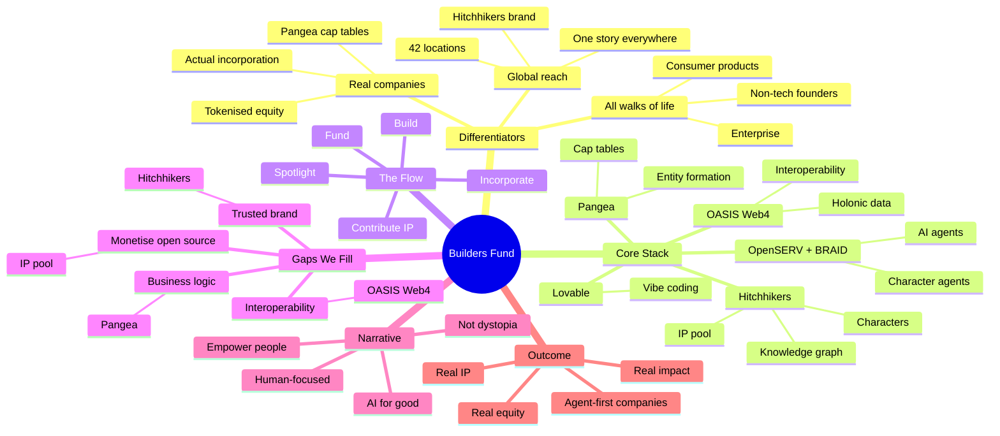
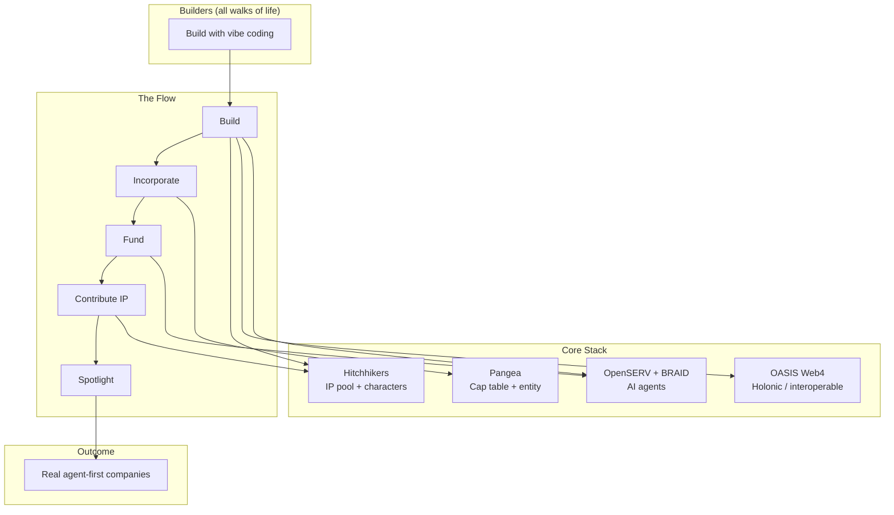
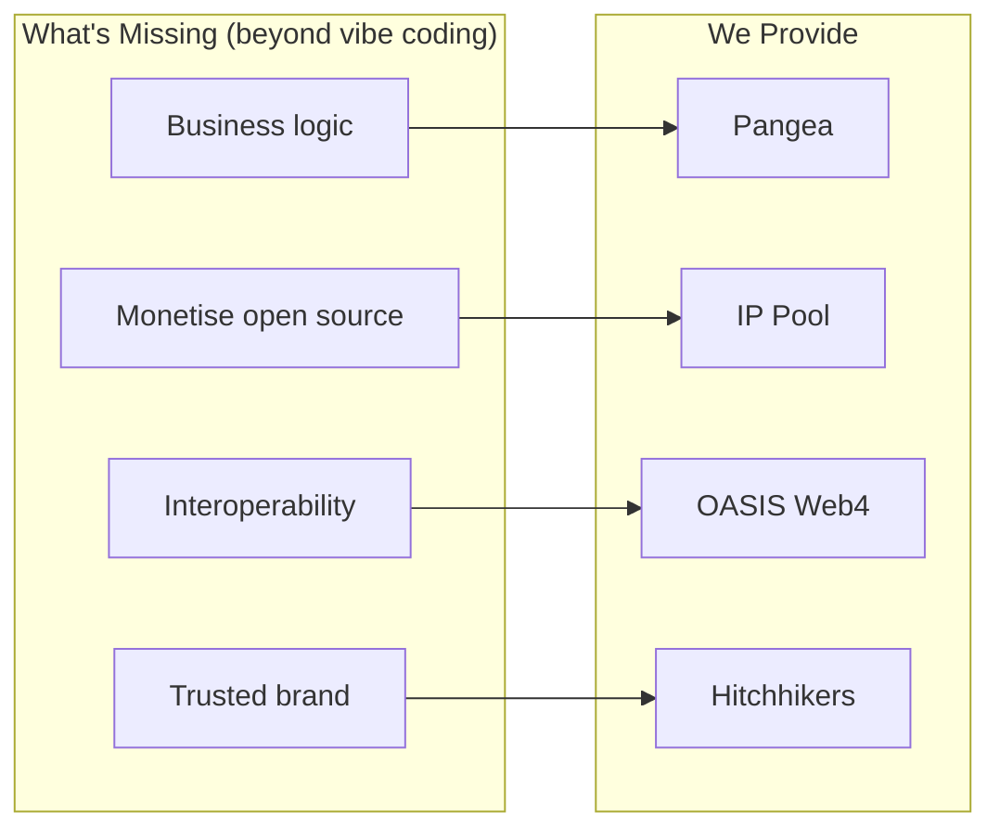

# Builders Fund Structure

**One-line pitch:** We create real agent-first companies, from enterprise, consumer, and non-tech builders worldwide, powered by OpenSERV, Pangea, and Hitchhikers.

---

## Key Differentiators

### 1. Real companies, not demos

Other programs produce demos, MVPs, or hackathon projects that die. We produce **actual companies** with cap tables, equity, and legal entities.

- **Pangea cap table** = real incorporation, real equity, real governance
- **OpenSERV agents** = real operating assets inside those companies
- **Outcome:** Agent-first businesses, not one-off experiments

*"We don't fund projects. We fund companies."*

### 2. All walks of life

The Builders Fund is not just for developers. We invite:

- Enterprise employees exploring AI
- Non-tech founders (designers, operators, domain experts)
- Consumer product builders
- Anyone asking: *"How do I incorporate AI into what I do?"*

**The question we answer:** How can we use this stack to create the next wave of **consumer products that help people**, not just technical demos?

*"You don't need to be a coder. You need to have a problem worth solving."*

### 3. Global reach via Hitchhikers

Hitchhikers brings:

- A globally recognised brand and story
- 42 locations and hub networks
- A narrative that travels across cultures
- A tone that feels human and approachable, not corporate

*"One story. 42 locations. Global builders."*

---

## Beyond Vibe Coding

Lots of people are vibe coding now. AI-assisted development is the new normal. But vibe coding alone produces demos, not businesses. What's still missing:

| Gap | Solution | Provider |
|-----|----------|----------|
| **Actual business logic** | Cap tables, incorporation, governance, equity | Pangea |
| **Easy monetisation of open source** | IP pool with tithing: creators get paid when others use their work | Hitchhikers IP Pool |
| **Interoperability by default** | Identity and data that work across chains and platforms | OASIS Web4 |
| **A brand people trust** | Global, non-crypto narrative that grounds futuristic tech | Hitchhikers |

We fill the gap between "I built something with AI" and "I run a company."

---

## Core Stack (5 Ingredients)

| Ingredient | Provider | What it does |
|------------|----------|--------------|
| **AI agents** | OpenSERV + BRAID | Character agents, reasoning, orchestration |
| **Holonic interoperability** | OASIS | Persistent identity, cross-chain data, anarchive |
| **Cap table & entity formation** | Pangea | Tokenised equity, incorporation, governance |
| **Knowledge graph + Hitchhikers IP** | (TBC) + Hitchhikers | Narrative, characters-as-agents, IP pool |
| **Vibe coding** (optional) | Lovable | AI-assisted development for builders |

---

## The Flow

1. **Build:** Teams use the stack (agents, holons, guides, vibe coding) to build ventures.
2. **Incorporate:** Pangea creates cap tables and entities; tokenised equity.
3. **Fund:** OpenSERV deploys capital (Builders Fund) in exchange for equity (Solana Colosseum model).
4. **Contribute IP** (optional): Builders can place IP into the Hitchhikers IP pool; creators get paid via tithing.
5. **Characters as agents:** Marvin, Zaphod, Trillian, etc. personified as agents throughout the process.
6. **Spotlight:** Best teams get Hitchhikers / OpenSERV PR push.

---

## Narrative Angle: AI for Good, Not Dystopia

**"AI is accelerating. People are afraid. We build agents that make the world better."**

- **Giant AI companies are looking for dominance.** We need human-focused technology systems that empower people, not lock them in.
- The Builders Fund = proof that agents can build businesses that help people, not replace them.
- Focus: agent-assisted ventures, not agent-only automation.
- Hitchhikers tone: wit, curiosity, "don't panic", antidote to doom.
- Tangible outcome: real companies, real equity, real IP, real impact.

---

## Principles (Keep It Simple)

1. **One clear flow:** Build → Incorporate → Fund → (Optional) Contribute IP → Spotlight.
2. **One stack:** Five ingredients; each partner has a clear role.
3. **One outcome:** Agent-first companies with real equity and real IP.
4. **One story:** "Build with agents, not against them."

---

## Mindmap: How the Pieces Fit Together

### Overview

### How the Stack Connects

### Gap to Solution Map

---

## Related Documents

- [Harish Executable Equity OpenServ Grant Proposal](./HARISH_EXECUTABLE_EQUITY_OPENSERV_GRANT_PROPOSAL.md): Infrastructure for agent-operated companies (Pangea + OpenSERV)
- [IP Pool & Builders Fund Partner Overview](../LFG/IP_Pool_and_Builders_Fund_Partner_Overview.md)
- [Save the Planet with Zaphod Brief](../../Hitchhikers/SAVE_THE_PLANET_WITH_ZAPHOD_BRIEF.md)
