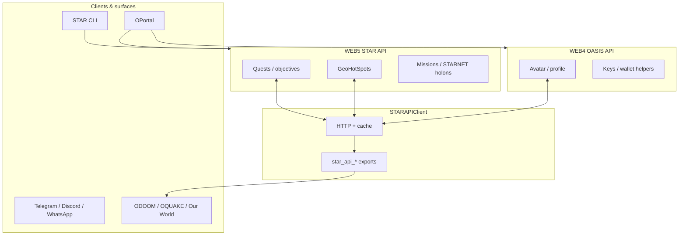
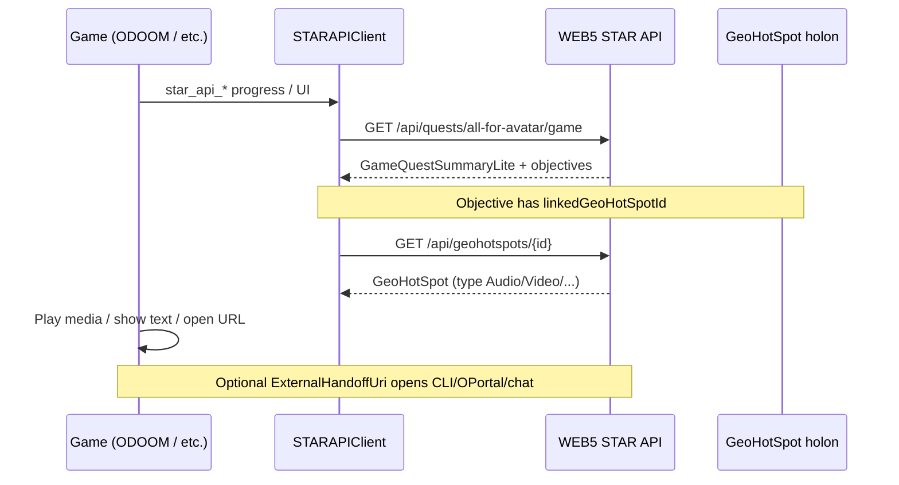

# OGEngine — Omniverse Game Engine (users & developers)

This document describes the **OGEngine**: the combined stack that powers cross-game quests, geo experiences, and STAR integrations. It is aimed at **end users** (what you can do) and **developers** (how the pieces connect and what to implement next).

---

## 1. What is the OGEngine?

**OGEngine** is not a single binary. It is the **contract and runtime** formed by:

| Layer | Role |
|--------|------|
| **WEB4 — OASIS API** | Identity, avatar profile, persistence helpers (e.g. `ActiveQuestId` / `ActiveObjectiveId`), subscriptions, keys, data aggregation. Base URL: `oasis_api_url` in client config. |
| **WEB5 — STAR API** | Quest definitions, objectives, progress, GeoHotSpots, missions, STARNET holons. Source of truth for gameplay state the games sync to. Base URL: `star_api_url` / `Web5StarApiBaseUrl`. |
| **STARAPIClient** | Native (or managed) client that talks to WEB5, exposes **`star_api_*`** to games (OQuake, ODOOM, Our World, etc.), and merges quest progress locally. |

Together, these three let **quests span games, apps, and the real world** while one avatar profile and one quest graph stay coherent.

---

## 2. For users (short)

- **Beam in** (STAR / OASIS) so your avatar is known to WEB4 and WEB5.
- **Start quests** in a game; progress is stored on **WEB5** and mirrored in the client cache.
- **GeoHotSpots** can mark real-world places: today **map / AR / VR / IR**; **media types** (audio, video, text, website links) are supported so that when you **arrive** at a hotspot (or trigger it in AR), the experience can **play media or show a link** (see developer section for rollout in each app).
- **Cross-app quests** (roadmap): objectives may point you to **another game**, **STAR CLI**, **OPortal**, **a website**, or **a chat** (Telegram, Discord, WhatsApp). You complete a step there (e.g. receive a code / finish a task) and return to unlock the next objective.

---

## 3. For developers — stack details

### 3.1 WEB4 (OASIS API)

- Use for **avatar-scoped** fields that must survive sessions across devices: active quest pointers, preferences, etc.
- See repo docs: `Docs/Devs/API Documentation`, `INTEGRATION_GUIDE.md`, `COMBINED_API_OVERVIEW` (where linked).

### 3.2 WEB5 (STAR API)

- **Quests**: CRUD, start, complete objective, progress (`POST .../progress`), game-shaped DTOs under `/api/quests/.../game`.
- **GeoHotSpots**: `GET/POST/PUT/DELETE .../api/geohotspots` (see `GeoHotSpotsController`).
- Holon subtype for GeoHotSpots is stored as **`GeoHotSpotType`** in STARNET DNA (same enum as `NextGenSoftware.OASIS.API.Core.Enums.GeoHotSpotType`).

### 3.3 STARAPIClient

- Implements `star_api_*` for native games; **no HTTP from the game DLL** — only the client.
- Quest list cache, progress merge, optional full refresh after POST.
- See `OASIS Omniverse/STARAPIClient/README.md` and `STAR_Quest_System_Developer_Guide.md`.

---

## 4. GeoHotSpot types (system model)

**Existing (location / AR):**

- `Map`, `AR`, `VR`, `IR` — geolocation, radius, AR objects/images, triggers (`GeoHotSpotTriggeredType`).

**New (media & links) — when the player reaches the hotspot (or triggers it in-app):**

| `GeoHotSpotType` | Holon fields (payload) | Intended client behaviour |
|------------------|-------------------------|---------------------------|
| `Audio` | `AudioUrl` | Play streamed or file audio. |
| `Video` | `VideoUrl` | Play video (fullscreen or in-world surface). |
| `Text` | `TextContent` | Show message / narrative (UI panel). |
| `WebsiteLink` | `WebsiteUrl` | Open in browser or in-app web view. |

These are **first-class** on the **`GeoHotSpot`** holon (`AudioUrl`, `VideoUrl`, `TextContent`, `WebsiteUrl`) alongside `Lat`, `Long`, `HotSpotRadiusInMetres`, and AR assets. The **category** for STARNET create flows remains **`GeoHotSpotType`** (Audio, Video, …).

**Quest integration (optional):**

- **`Quest.LinkedGeoHotSpotId`** — optional anchor hotspot for the whole quest.
- **`Objective.LinkedGeoHotSpotId`** — optional hotspot per objective.
- **`Quest.ExternalHandoffUri`** / **`Objective.ExternalHandoffUri`** — optional URI for **cross-app** steps (e.g. `https://`, `star-cli://`, `https://t.me/...`, OPortal routes). Clients should treat these as **opaque** until the OGEngine routing layer defines schemes.

**Game DTOs** (`GameQuestSummaryLite`, `GameQuestObjectiveLite`) expose `linkedGeoHotSpotId` and `externalHandoffUri` for thin JSON in games.

---

## 5. Roadmap (OGEngine)

### 5.1 GeoHotSpots in quests

- **Already**: Dependencies can attach GeoHotSpots to STARNET holons; **runtime** quest rows can reference hotspots via **`LinkedGeoHotSpotId`** and objective dictionaries (`NeedToGoToGeoHotSpots`).
- **Next**: First-class UI in **Our World / OPortal** to pick a hotspot when authoring a quest; **in-game** surfaces (ODOOM, OQUAKE) to **fetch hotspot by id** and run **Audio / Video / Text / Website** behaviour when the player satisfies the trigger.

### 5.2 General GeoHotSpots (outside quests)

- Hotspots remain **standalone holons**; apps list them by radius or id. Quest linkage is **optional**.

### 5.3 Cross-surface quest handoff

The OGEngine will connect:

- **STAR CLI** — scripted `quest` commands, `--json`, objectives.
- **OPortal** — web flows, deep links.
- **Telegram / Discord / WhatsApp** — bot or invite links as `ExternalHandoffUri`.
- **Any game** — same WEB5 quest id / objective ids; codes or tokens can be modeled in **requirements** or future **metadata** fields.

**Pattern:** objective N → `ExternalHandoffUri` → user completes task → **complete objective** via API or game client → objective N+1 unlocks.

---

## 6. API reference (this repo)

| Area | Location |
|------|-----------|
| GeoHotSpot holon + URLs | `ONODE/.../Holons/.../GeoHotSpot.cs`, `GeoHotSpotType` enum |
| Quest / objective links | `QuestBase`, `Objective`, `IQuestBase`, `IObjective` |
| HTTP | `STAR.WebAPI/Controllers/GeoHotSpotsController.cs`, `QuestsController.cs` (`CreateQuestRequest`, `QuestObjectiveRequest`, `AddQuestObjectiveRequest`) |
| Game lite DTOs | `STAR.WebAPI/Models/GameQuestLiteDtos.cs`, `GameQuestSummaryLiteMapper.cs` |
| Quest system guide | `STAR_Quest_System_Developer_Guide.md` |

---

## 7. Diagram — quest + GeoHotSpot + handoff

---

## 8. Related documents

- `STAR_Quest_System_Developer_Guide.md` — API + client + games (updated for GeoHotSpot links and handoff fields).
- `STAR_Games_User_Guide.md` — player-facing keys and behaviour.
- `INTEGRATION_GUIDE.md` — broader OASIS integration.
- `AGENTS.md` (repo root) — agent policy for root-cause fixes.

---

*Document version: aligned with OASIS repo changes introducing GeoHotSpot media types and quest/objective `LinkedGeoHotSpotId` / `ExternalHandoffUri`.*
