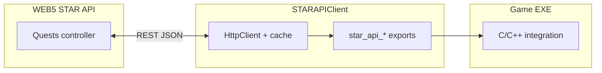

# STAR Quest System — developer guide (API + client + games)

This document explains how **quests** flow from the **WEB5 STAR API** through **STARAPIClient** into **native games** (OQuake, ODOOM), so you can extend the backend, ship a new client, or integrate another engine without reverse-engineering the tree.

**Related docs**

| Topic | Location |
|--------|-----------|
| Phase 2 overview (short) | `OASIS Omniverse/Docs/PHASE2_QUEST_SYSTEM.md` |
| ODOOM quest list invariants (UI/CVar pipeline) | `OASIS Omniverse/Docs/ODOOM_Quest_List_STAR.md` |
| WEB5 quest endpoint catalog (reference style) | `Docs/Devs/API Documentation/WEB5 STAR API/Quests-API.md` |
| STAR + WEB5 overview | `Docs/Devs/API Documentation/WEB5_STAR_API_Documentation.md` (Quests section) |
| **OGEngine (WEB4 + WEB5 + STARAPIClient)** | `OASIS Omniverse/Docs/OGEngine_Overview.md` |
| STARAPIClient design | `OASIS Omniverse/STARAPIClient/README.md` |
| End-user keys / `star` commands | `OASIS Omniverse/Docs/STAR_Games_User_Guide.md` |
| Contract DTOs | `NextGenSoftware.OASIS.API.Contracts` — quest/objective types used by client + API |

---

## 1. Architecture (three layers)

1. **WEB5 STAR API** — Source of truth for quest definitions, status, objective completion, and **realtime progress** (`/progress`). Hosted STAR ODK / ONODE stack; base URL is `star_api_url` in `oasisstar.json`.
2. **STARAPIClient** — NativeAOT (or managed) assembly implementing `star_api_*`. Handles auth headers, **quest list cache**, **optimistic merge** after progress POSTs, background workers, and serialization for in-game UI.
3. **Game** — Calls C ABI only (no HTTP). Emits gameplay events (pickups, kills, level time) via queues; opens quest UI by reading serialized strings from the client.

**WEB4** (`oasis_api_url`) stores **avatar profile** fields such as **ActiveQuestId** and **ActiveObjectiveId** so the tracker survives beam-in; quest *definitions* and *progress* remain on WEB5.

---

## 2. API level (implementing or calling WEB5)

### 2.1 Auth

Same as the rest of STAR: **Bearer JWT** after SSO, or API-key style headers the client already sets. The client sends the same identity to WEB5 and WEB4.

### 2.2 Endpoints the shipped client actually calls

These paths are relative to **`Web5StarApiBaseUrl`** (no trailing slash required; client normalizes).

| Purpose | Method | Path | Notes |
|--------|--------|------|--------|
| List quests (game DTO) | GET | `/api/quests/all-for-avatar/game` | Primary full list for cache |
| List by status (game DTO) | GET | `/api/quests/by-status/{status}/game` | e.g. `InProgress`, `Not Started` — URL-encoded |
| Single quest | GET | `/api/quests/{questId}` | Hydrate / admin-style |
| Can start | GET | `/api/quests/{questId}/can-start` | Gating |
| Start quest | POST | `/api/quests/{questId}/start` | |
| Complete objective | POST | `/api/quests/objectives/complete` | **JSON body**: `questId`, `objectiveId`, `gameSource`, `completionNotes` |
| Complete quest | POST | `/api/quests/{questId}/complete` | |
| **Realtime progress** | POST | `/api/quests/{activeQuestId}/progress` | Body: `gameSource`, deltas (`monstersKilledDelta`, `xpEarnedDelta`, `keysCollectedDelta`, `armorCollectedDelta`, `healthCollectedDelta`, `weaponsCollectedDelta`, `powerupsCollectedDelta`, `ammoCollectedDelta`, `genericItemPickup`, `itemCollectedName`, optional `levelTimeSeconds`, optional `activeObjectiveId`) |
| Create quest | POST | `/api/quests/create` | Tools / cross-game setup |
| Add objective | POST | `/api/quests/{questId}/objectives` | |
| Remove objective | DELETE | `/api/quests/{questId}/objectives/{objectiveId}` | |
| Sub-quests | POST/DELETE | `/api/quests/.../subquests` | |

**Important:** Objective completion in the current client is **`POST /api/quests/objectives/complete`** with IDs in the body — not only the older pattern `POST /api/quests/{id}/objectives/{id}/complete`. Backend must support what you deploy.

### 2.3 Game DTO routes (`/game`)

Responses are **flat JSON** suited for clients (not full holon graphs). Implementations live in STAR ODK / ONODE; keep field names aligned with **`NextGenSoftware.OASIS.API.Contracts`** quest DTOs so STARAPIClient deserialization stays stable.

### 2.4 Progress endpoint contract

- The client only POSTs progress when there is a **non-empty cached active quest id** (from avatar profile / tracker) and **at least one non-zero delta**.
- While the in-game **quest list popup is open**, progress POSTs and cache replacement from GET are **suppressed** (`star_api_set_quest_popup_open(1)`); gameplay still merges locally in **client-merge** mode when configured.

### 2.5 GameSource / multi-game

**`gameSource`** (e.g. `ODOOM`, `OQUAKE`, `Quake`, `Doom`) must align with **objective requirement dictionaries** on the server (`NeedToKillMonsters`, `NeedToCollectItems`, etc.) so progress increments the correct row. The client sets game source from:

- **`StarApiConfig.ClientGameSource`** / native **`client_game_source`** in `star_api_config_t` (e.g. ODOOM sets `"ODOOM"`), and
- Per-call arguments on pickups / kills / objective completion.

### 2.6 GeoHotSpots, quest linkage, and cross-app handoff

- **GeoHotSpot holon** (`GeoHotSpotType`): includes **Map, AR, VR, IR** and media types **Audio, Video, Text, WebsiteLink**. Payload fields: `AudioUrl`, `VideoUrl`, `TextContent`, `WebsiteUrl` (see `ONODE` holon + `GeoHotSpotsController`). Subtype is stored in STARNET DNA as **`GeoHotSpotType`**.
- **Quest** optional fields: `LinkedGeoHotSpotId`, `ExternalHandoffUri`.
- **Objective** optional fields: `LinkedGeoHotSpotId`, `ExternalHandoffUri`.
- **Create / add objective** requests accept the same (`CreateQuestRequest`, `QuestObjectiveRequest`, `AddQuestObjectiveRequest`). An objective **must** have either at least one **Need\*** dictionary entry **or** a **LinkedGeoHotSpotId** **or** **ExternalHandoffUri** (in addition to title and description).
- **Game DTOs** (`GameQuestSummaryLite`, `GameQuestObjectiveLite`) expose `linkedGeoHotSpotId` and `externalHandoffUri` for thin JSON in clients.
- **Roadmap**: clients (Our World, OPortal, ODOOM, OQUAKE) should load the hotspot by id when present and **play / show** media or open links on trigger; **handoff URIs** are opaque until routing schemes are standardized (STAR CLI, OPortal, Telegram, Discord, WhatsApp, web). See **`OGEngine_Overview.md`**.

---

## 3. Client level (STARAPIClient)

### 3.1 Key types

- **`StarQuestInfo`**, **`StarQuestObjective`**, dictionary types — in **API.Contracts** (see README).
- **`QuestProgressCacheRefreshMode`**: **`ClientCacheMerge`** (default) vs **`FullServerRefresh`** after each successful progress POST (`star_api_set_quest_progress_cache_refresh` / `oasisstar.json` `quest_progress_refresh`).

### 3.2 C# methods (representative)

Games use the C ABI; managed hosts can call:

- `GetQuestsForAvatarGameAsync`, `GetQuestsByStatusGameAsync`
- `StartQuestAsync`, `CompleteQuestObjectiveAsync`, `CompleteQuestAsync`
- `QueueCompleteQuestObjectiveAsync` / `FlushQuestObjectiveJobsAsync` (batching)
- Internal: `ApplyQuestProgressToActiveQuestAsync` driven by pickups / kills / level time queues

### 3.3 C ABI — quest-related (`star_api.h`)

| Export | Role |
|--------|------|
| `star_api_start_quest` | Start by quest GUID string |
| `star_api_start_quest_then_set_active_objective` | Start then persist active objective (async ordering) |
| `star_api_complete_quest_objective` | Manual objective complete |
| `star_api_complete_quest` | Quest complete |
| `star_api_get_quests_string` | Full serialized list (cache) |
| `star_api_get_top_level_quests_string` | Parent quests only (left panel) |
| `star_api_get_quest_sub_quests_string` | Sub-quests for parent id |
| `star_api_get_quest_objectives_string` | Objectives for parent id |
| `star_api_get_quest_prereqs_string` | Prerequisite quests |
| `star_api_get_quest_objective_requirements_string` | Human-readable requirement lines |
| `star_api_get_quest_tracker_objectives_string` | Tracker lines |
| `star_api_get_quest_tracker_active_objective_index` | First incomplete index |
| `star_api_get_tracker_quest_name` | HUD title |
| `star_api_invalidate_quest_cache` | Force refetch path on next read |
| `star_api_refresh_quest_cache_in_background` | Non-blocking refresh |
| `star_api_set_quest_popup_open` | Suppress progress + full GET while UI open |
| `star_api_get_active_quest_id` / `star_api_get_active_objective_id` | From last profile |
| `star_api_set_active_quest` | Persist tracker to WEB4 avatar detail |
| `star_api_queue_quest_progress_from_pickup` | Progress only (no inventory add) |
| `star_api_queue_monster_kill` | Kills + XP → progress pipeline |
| `star_api_queue_quest_level_time` | Level elapsed seconds (OQuake ~10s throttle) |

**Wire format** for `get_*_quests_string` lines: tab-separated records; **`Q\t`** quests, **`O\t`** objectives; blocks separated by **`---`**. ODOOM ZScript and OQuake menu code parse this family; changing it requires coordinated updates (see `OASIS Omniverse/Docs/ODOOM_Quest_List_STAR.md`).

### 3.4 Plugging in a new native game

1. Ship **`star_api`** (same ABI) next to your executable; **`LD_LIBRARY_PATH`** / `PATH` as in OQuake build scripts.
2. **`star_api_init`** with **`Web5StarApiBaseUrl`**, **`Web4OasisApiBaseUrl`**, and set **`client_game_source`** to a string your **quest objectives** use in DNA/API.
3. After beam-in, call **`star_api_refresh_avatar_profile`** (or equivalent) so **active quest / objective** loads into the client cache.
4. On gameplay events, use **queues** (`queue_add_item`, `queue_monster_kill`, `queue_quest_progress_from_pickup`, `queue_quest_level_time`) so the main thread does not block.
5. For UI, poll **`star_api_get_top_level_quests_string`** (and detail APIs) into your engine; call **`star_api_set_quest_popup_open(1)`** while the list is visible.
6. When the user picks a tracked quest/objective, call **`star_api_set_active_quest`** so **`/progress`** targets the right quest.

---

## 4. Game integrations (reference)

| Concern | OQuake | ODOOM |
|---------|--------|--------|
| Quest list UI | **`oquake_star_integration.c`** — Q key, tabbed panels, Enter/K | **`uzdoom_star_integration.cpp`** + **`odoom_inventory_popup.zs`** |
| Tracker / HUD | Same file + `star_api_get_quest_tracker_*` | ZScript + CVars |
| Serialization consumer | Native C strings | **`odoom_quest_list`** CVar (size limits — see ODOOM doc) |

Do not change **objective completion** or **progress** semantics only on one game if both share the same STAR backend; keep **gameSource** consistent with quest JSON.

---

## 5. Configuration knobs (`oasisstar.json`)

| Key | Effect |
|-----|--------|
| `star_api_url` | WEB5 base |
| `oasis_api_url` | WEB4 base (avatar, inventory, active quest ids) |
| `quest_progress_refresh` | ODOOM: `client` vs `server` — maps to client-merge vs full GET after progress |
| `client_game_source` | Set via native config struct / engine default |

OQuake uses **`star_api_set_quest_progress_cache_refresh`** from loaded config where wired.

---

## 6. Testing checklist

- Beam-in → profile shows **ActiveQuestId** / **ActiveObjectiveId** when set on server.
- Kill / pickup with active quest → **POST /progress** (or optimistic HUD merge if server down).
- Open quest list → **no** progress POST until closed (verify with `star debug on` + `star_api.log`).
- Complete objective → **POST objectives/complete** → cache invalidated → list refresh.
- Cross-game quest: objectives use different **gameSource** keys; verify each engine increments its row.

---

## Changelog

| Date | Note |
|------|------|
| 2026-03-27 | Initial consolidated developer guide (API + STARAPIClient + extension points). |
| 2026-04-02 | GeoHotSpot media types (Audio/Video/Text/WebsiteLink); quest/objective `LinkedGeoHotSpotId` / `ExternalHandoffUri`; see `OGEngine_Overview.md`. |
